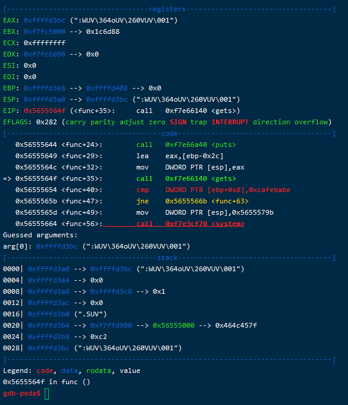

# bof

题目来源：https://pwnable.kr/

题目的意思很明显了，在这个给出的程序中有一个缓冲区溢出的漏洞。而这道题将可执行文件和目标文件都提供了出来，那么先查看一下源文件来看一下代码：

```c
#include <stdio.h>
#include <string.h>
#include <stdlib.h>
void func(int key){
        char overflowme[32];
        printf("overflow me : ");
        gets(overflowme);       // smash me!
        if(key == 0xcafebabe){
                system("/bin/sh");
        }
        else{
                printf("Nah..\n");
        }
}
int main(int argc, char* argv[]){
        func(0xdeadbeef);
        return 0;
}
```

从这个源码中可以看到 main 函数调用了 func 函数，参数是 0xdeadbeef，随后分析这个 func 函数，控制流相当简单，像这个 overflowme 缓冲区中输入字符串，而如果参数 key 是 0xcafebabe 的话，就获得当前的控制台，而我们的目标呢，就是要获取控制台，打开 flag 文件。

这道题有别于前面的题目，并不是直接登录到服务器的目录中，而是通过一个进程，来夺取服务器的权限。

>很多题目都使用的是 nc 命令来访问服务器上的程序。
>
>nc，全名 NetCat，是一个网络工具，可以通过 TCP 或者 UDP 协议来传输数据。这个命令可以首先很多功能，比如远程拷贝文件，端口扫描等等。在这里一般出题人使用 nc 命令访问某个端口，而这个端口运行着某个有漏洞的程序。

那么回到这道题上面，很明显是要想办法让 key 等于目标值，但是很奇怪的是在调用这个函数的时候，key 的值是一个硬编码的参数，似乎这道题是没有问题的。

但是问题就出在这个 gets 上。gets 可以从标准输入中读取一行，遇到换行符返回，但是这里所声明的 overflowme 只有 32 个字节，**而 gets 函数是不会检查目标缓冲区中能不能装下字符串的**，所以这里就造成了缓冲区溢出的漏洞。

> c 语言中可以使用 fgets 代替 gets。

---

这里要差一个小问题，这个给出的目标程序使用 file 命令可以发现它是 ELF-32 类型的，也就是 32 位可执行文件，我在 Windows 的 WSL 中尝试运行但是总是失败，连链接器都无法使用，所以在运行之前，应该先观察文件的具体类型和格式。

---

通过 gdb 开始调试并查看压栈的情况：

直接将断点打在 main 函数上，来看一下运行到 func 函数是是什么样的。


观察一下栈帧，可以发现现在栈顶是返回地址，也就是 call 指令的下一句的地址，而栈顶上方存放的就是输入的参数 key，合乎情理，因为调用函数的时候先压入参数，然后压入返回地址。

> 为什么要分清楚 32 位和 64 位就是因为在函数调用的处理方面，x64 会使用寄存器来处理，这就有别于这个了。

那么再运行下面的语句，很明显会把 ebp 压入栈中，随后开辟 0x48 大小的栈空间。接下去看一下运行到判断的分支语句的情况：



puts 对应的是 printf 语句，也就是打印了字符串，随后就会使用 gets 函数读，注意 eax 放的就是 buf 的起始位置，它的位置在 ebp-0x2c 的位置上。然后我们再查看一下有一个 cmp 指令，要比较的 key 存在 ebp+0x8 上。这也是合乎情理，因为目前的 ebp 和参数中间相隔了一个老  ebp 和返回地址。

**这样根据缓冲区溢出的原理，我们需要在缓冲区中构造相应的数据，能够覆盖到 key 参数对应的地址。这里很明显先要填充 0x2c + 0x08 个任意字符，然后将 0xcafebabe 按照小端填充到目标地址**，这样完成了缓冲区溢出的攻击。