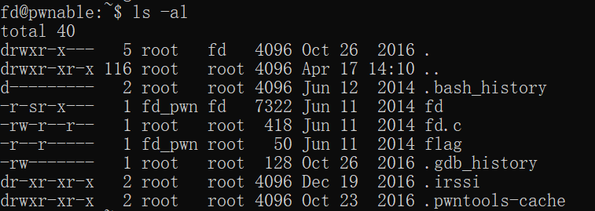

# fd

题目来源：https://pwnable.kr

这是这个网站的第一道题目，有关文件描述符，所以记录一下目前用到的一些知识点：

根据题目要求登录服务器，可以看到在这个服务器的用户目录下一共包含了三个文件：fd、fd.c、flag。使用命令看一下：



可以看到对于这三个普通文件，fd 对于拥有者和用户组中的成员都只有读和执行的权限，而 fd.c 除了拥有者有写的权限，其他用户都只有读的权限，而 flag 这个文件就除了拥有者可写可读，其他用户均无任何权限。然而我们可以看到这个文件夹中，我们是以 fd 用户身份登录的，所以我们只有非常有限的权限，即 ls 当前目录、执行 fd 可执行文件以及看 fd.c 的源码。而很显然最终要的 flag 一定就在 flag 文件中，可惜目前不能直接使用 cat 查看。

> 这里注意一个细节，在 fd 的文件权限中有一个 s 类型的权限。如果查阅网上有关这个权限的介绍可以知道：
>
> 包含S_ISUID、S_ISGID两个常量在内，叫做强制位权限，作用在于**设置使文件在执行阶段具有文件所有者的权限，相当于临时拥有文件所有者的身份**. 典型的文件是passwd. 如果一般用户执行该文件, 则在执行过程中, 该文件可以获得root权限, 从而可以更改用户的密码。在设置s权限时文件属主、属组必须先设置相应的x权限，否则s权限并不能正真生效（c h m o d命令不进行必要的完整性检查，即使不设置x权限就设置s权限，chmod也不会报错，当我们ls -l时看到rwS，大写S说明s权限未生效）
>
> 也就是说我们在执行的时候相当于是以 root 权限的去执行这个文件的。

看一下 fd.c 的源码：

```c
#include <stdio.h>                                                                       #include <stdlib.h>                                                                        #include <string.h>                                                                       char buf[32];                                                                             int main(int argc, char* argv[], char* envp[]){
	if(argc<2){
		printf("pass argv[1] a number\n");
		return 0;
	}
	int fd = atoi( argv[1] ) - 0x1234;
	int len = 0;
	len = read(fd, buf, 32);
	if(!strcmp("LETMEWIN\n", buf)){
		printf("good job :)\n");
		system("/bin/cat flag");
		exit(0);
	}
	printf("learn about Linux file IO\n");
	return 0;
}   
```

这个代码的逻辑不难理解：变量 fd 是从输入参数中获取的字符串通过 atoi 函数转换为整型后减去 0x1234 获得的。这个变量代表了下面要打开的文件描述符，而通过 read 函数读入 32 个字节保存到 buf 中，比较 buf 中的字符串和 LETMEWIN 是否一致，如果相同就可以使用 system 函数打开 flag 文件，否则永远直接推出程序。

那么思路很简单，由于这个逻辑并没有出现类似 open 的函数，所以这个要想在 buf 中出现目标字符串必须人为输入，那么就希望是通过控制台的输入了：

> 文件描述符简单的说就是内核来访问文件的一个标识，它是一个非负的整数。正常情况下打开和创建文件都会返回相应文件的文件描述符。但是有几个特殊的文件描述符，在 unistd.h 头文件中定义了 0 为 stdin，1 为 stdout，2 为 stderr。

所以如果我们想通过控制台输入，只需要保证 fd 的计算结果为 0，这样问题就很简单了 0x1234 对应整数 4660，我们有如下的操作：


可以看到最后一句就是 flag 文件中的内容了，也就是这道题需要的 flag。

---

这个文件中有四个函数是值得注意的，下面就简单的看一下：

* atoi：这个函数把字符串转换成整数，如果该输入无法转换为 int 类型的值，就返回 0。注意它无法返回超过int 的数据，超出 int 范围会直接返回 2136764973。
* read：需要三个参数，一个文件描述符，一个缓冲区用来存放数据，还有一个 count 表示每次想要读取的字节数。由于这个函数没有考虑到缓冲区的边界问题，所以很有可能出现溢出。
* strcmp：比较字符串大小的函数，如果相同返回 0。否则按照 ascii 比较字符串大小。
* system：c 语言中调用命令的函数，在 linux 中会调用 fork 产生子进程来执行相应的命令。

