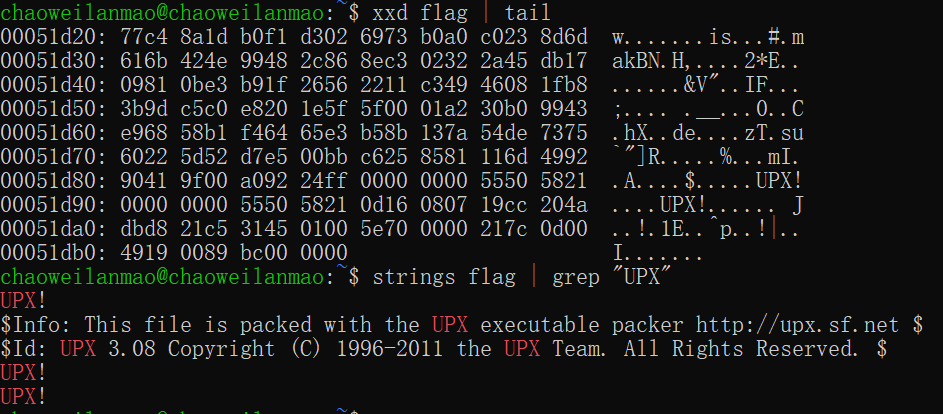
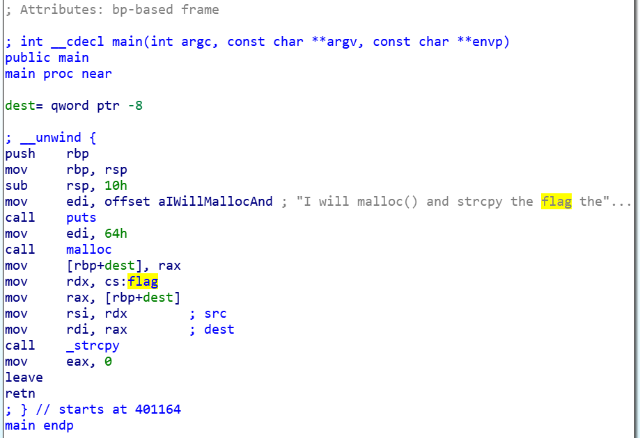
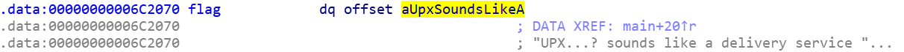

# flag

题目来源：https://pwnable.kr/

这道题目只给了一个可执行文件，题目的意思是要逆向这个可执行文件，因为这个文件是一个 ELF-64 的文件，而且优势逆向题，所以下意识先用 objdump 想看看反汇编的结果，但是很奇怪的是用 objdump 之后该文件无法正确地被反汇编。

那我就用 IDA 吧，它也接受 ELF 格式的文件。使用 IDA 直接打开这个可执行文件，想要查看这个可执行文件的控制流时，发现出现了乱码，无法识别函数名，就连指针的地址分析也出现了异常。查找了网上的相关资料，发现可能是符号表被删除无法解析，又或者本身函数中的链接出现异常需要手动调整。由于没有经验所以暂时搁置。

---

现在重新来看，经过网上的提示得知，这个文件并不是普通的可执行文件，而是用 upx 软件加过壳的。

> 加壳全名可执行程序资源压缩，并且压缩后的程序是可以直接运行的。它本身可以阻止外部程序或软件对加壳程序本身的反汇编或者动态分析。

upx 就是比较经典的加壳程序，那么为什么知道是用 upx 加过壳的呢，是通过程序中的一些小信息得到的。理论上应该有对 ELF 格式文件分析是否有壳的软件，可惜像 PEID 等都只能查看 PE 格式。

学到一手，使用 xxd 查看文件 16 进制内容：

很显然了，这是用 UPX 打包过的程序，使用 upx -d 进行解压缩，获得目标的 flag 文件，此时再用 ida 分析，可以看到主函数：

可以看到在调用 strcpy 函数之前去访问过数据 flag，双击跟踪一下就能找到对应的字符串了：

所以这里总结一下，如果使用 objdump 或者 ida 这种反汇编程序对程序无法分析的时候，首先需要判断软件是否被加密、压缩、加壳处理过，这个需要总结各种方法的特征，然后想办法先还原程序，再作分析。