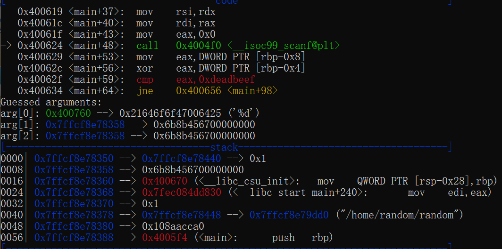

# random

题目来源：https://pwnable.kr/

这道题目和伪随机数生成有关，看一下题目的题面：

```c
#include <stdio.h>                                                                                                                         
int main(){
	unsigned int random;
	random = rand();        // random value!                                                                                                     
	unsigned int key=0;
	scanf("%d", &key);                                                                       
	if( (key ^ random) == 0xdeadbeef ){
		printf("Good!\n");
		system("/bin/cat flag");
		return 0;
	}                                                                                                                                             
	printf("Wrong, maybe you should try 2^32 cases.\n");
	return 0;                                                     
}  
```

这道题的重点就在于 `key ^ random == 0xdeadbeef` 这句判断语句。其中 key 是用户输入的，而 random 是一个伪随机数，使用了 c 语言的 rand 函数，那么很显然问题一定出在这里了，上网查找一下有关 rand 函数的细节。

> rand() 函数是再 stdlib.h 文件中，它用来产生随机数，内部实现是用线性同余法实现的，它最后会返回一个范围在 0 到 RAND_MAX 之间的伪随机数。在调用 rand() 函数之前理论上先要使用 srand() 函数设置随机种子，**但是假设没有设置则默认调用了 srand(1)**。

**最重点的是，如果随机的种子是相同的，那么每次产生的随机数也会相同**。所以一般使用和时间有关的种子。

像这道题中的 rand 函数在前面没有设置，最后导致的出来的随机数其实每次都是相同的。有了这个观察，只需要在一次执行中观察栈中产生的随机数就可以了:



从执行到的 scanf 函数下面来看，rbp-0x8 的地方存放着随机数，我们从下面栈中能够看到，就是 0x6b8b4567。如果不确定可以再运行一遍看看是不是真的不会改变。那么根据异或的运算法则，key ^ random ^ random = 0xdeadbeef ^ random = key，这样就能够获得真正的输入了。