# 123
## 题目内容
12341234，然后就解开了。
## 思路
点开链接，是一个登录界面：  
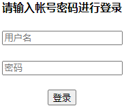  
这也没有注册页面呐，查看网页源码，发现了有用的东西：  
  
去访问 user.php 文件：  
http://x.changame.ichunqiu.com/user.php  
发现是空的，查看网页源码也没用，然后想到有两种方式可能能看到，一种是 phps ，即查看 php 源码，还有一种是去看 php 的备份文件，即 user.php.bak。最后发现 user.php.bak 是可访问文件，里面全是用户名，好了，根据 login.php 网页源码的提示开始爆破，模式也要选对哦：  
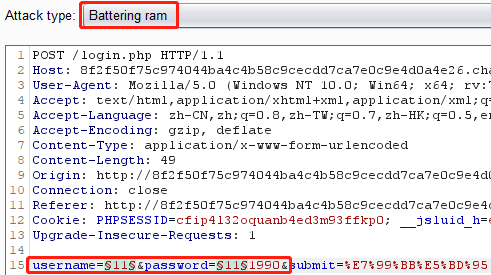  
当然，还要把刚刚找到的文件导入进去，充当字典：  
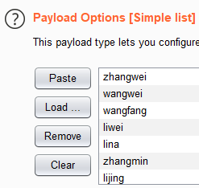  
找到了一个正确的用户名：  
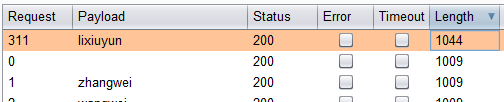  
看一下这个请求包：  
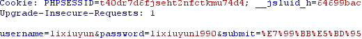  
然后就是用这个用户名登陆，结果发现是一个空白界面，查看网页源码：  
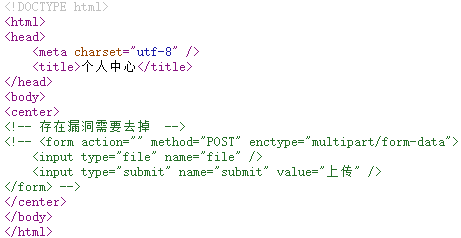  
根据注释，判断应该是一个文件上传漏洞，用 F12 修改一下网页代码，其实就是去掉注释：  
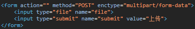  
然后出现一个文件上传的界面：  
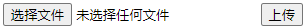  
上传一个 php 文件，说后缀只允许 jpg，png 啥的：  
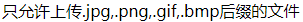  
把后缀名改成 .jpg，又说文件名不合法……就此僵住，没忍住，去看了 wp，好像是要构造不完善的黑名单扩展名来绕过检测……这只允许上传 xxx 后缀的文件，难道不是白名单？？我吐了……  
ass.jpg.phtml  
整了个这，上传上去，出现一个 view 的超链接，点进去：  
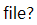  
file? file 啥 file，尝试传个 GET 参数，?file=aaa：  
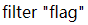  
哦，直接告诉我过滤了 flag，好的，过滤什么，绕过什么就行了，?file=flflagag：  
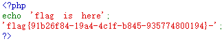  
