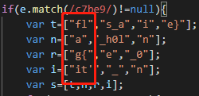

# NaNNaNNaNNaN-Batman
## 题目描述
暂无
## 思路
下载附件，用记事本打开：  
  
有些乱七八糟的东西，既然是 web 的题，那我们把文件的后缀改为 html，用浏览器打开试试：  
  
有东西了，随便输入几个东西，提交试试，发现没啥卵用。查看源码，发现还是有乱码，那加一个 alert(_); （这个 _ 是根据 eval(_); 函数来的），看看浏览器能不能帮我们解析一下：  
  
果然，成功了：  
  
我们用文本编辑器整理一下，便于审计：  
  
可以发现变量 e 是我们在输入框中提交的值，当这个值满足一定条件时，才会执行 for 循环，以得到结果：  
1. 值的长度为16  
2. 值的开头是 be0f23  
3. 值中要包含 233ac  
4. 值的末尾是 e98aa  
5. 值中要包含 c7be9  
只有一个值同时满足以上5个条件：be0f233ac7be98aa。我们用这个值提交一下，就得到了 flag：  
  
---
其实还有两个方法。  
第一是，我们不管 if 判断条件，直接在开发者工具的 console 中运行那几行代码，包括声明变量和 for 循环，同样能得到 flag。  
第二个方法是，直接分析那几个声明变量：  
  
第一列，明显是 flag{it' 这是多么通顺的排列，估计后面几列同样如此，继续分析。  
第二列 s_a_h0le_  
再来第三列 in_0n  
第四列 e}  
将四列合起来就是 flag{it's_a_h0le_in_0ne}，这么顺耳的一句话，明显就是 flag 了啊，直接提交！  
---
看了下官方 writeup，好像 sublime 要好用一些啊，我用的 vs code 完全没显示 <0x02> 啥的啊！  
