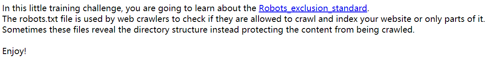
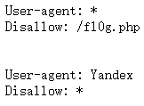

# Training-WWW-Robots
## 题目描述
暂无  

## 思路
http://220.249.52.133:43409  
点开题目链接：  
  

就是，大致说了一下 robots 协议的作用，不只是防爬虫，还可能会包含可访问的文件，那个 Robots_exclusion_standard 是关于 robots 协议的维基百科的链接。我们用之前的 robots 协议的知识，知道在该协议下，应当先访问 robots.txt 文件，http://220.249.52.133:43409/robots.txt：  
  

我们看到，有 f10g.php 这个文件，虽然写着是 Disallow，但是我们也先尝试访问一下，http://220.249.52.133:43409/fl0g.php：  
  
得到 flag。  
