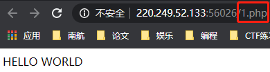
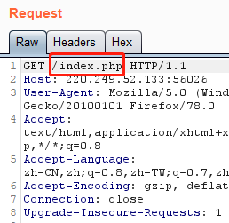
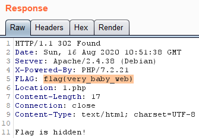
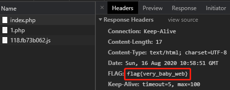

# baby_web
## 题目描述
想想初始页面是哪个？  
## 思路
http://220.249.52.133:56026  
点开题目链接：  
  

发现直接返回 1.php，burp 一下，看看是啥情况：
  

发现，GET 请求的就是 1.php，把它发到 repeater 中，改一下请求，即把 1.php 改为初始页面的文件 index.php：
  

查看 response 即可发现 flag：
  

---
其实也可不必这么麻烦，因为是 GET 请求，可以直接把 url 中的 1.php 改为 index.php 然后开 F12，查看 Network 里的内容就可以了：
http://220.249.52.133:56026/index.php
  
