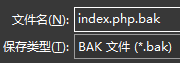
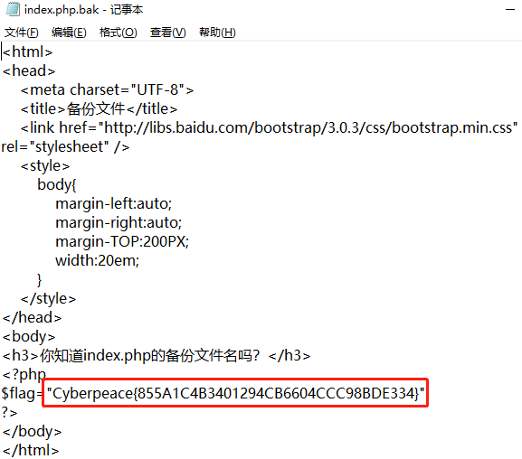

# backup
## 题目描述：X老师忘记删除备份文件，他派小宁同学去把备份文件找出来,一起来帮小宁同学吧！

### 思路
进入题目链接：  
http://220.249.52.133:35196  

尝试去访问 index.php 的备份文件，试到 “.bak” 时，出现了下载页面：  
http://220.249.52.133:35196/index.php.bak  

将下载下来的文件用记事本打开：  

成功获得 flag。

## 相关知识
1. 如果网站存在备份文件，常见的备份文件后缀名有：“.git” 、“.svn”、“ .swp” 、 “.~”、 “.bak”、 “.bash_history”、 “.bkf”。  
2. 而 php 类型的备份文件，其后缀一般是以下两种：“.~”、 “.bak”
