# bug
## 题目描述
暂无
## 思路
http://220.249.52.133:36757  
点开题目链接，说是让登录，并且有三个页面可供选择，登录、注册、以及找回密码。  
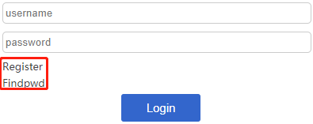  
随便注册了个用户，然后尝试一下，发现，进 manage 页面需要 admin 账户。  
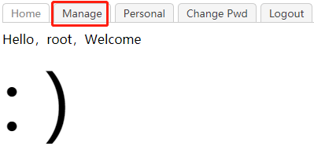  
尝试重复注册，失败。然后去看看找回密码是否有漏洞，发现是先验证，然后再重置密码，用 bp 试试：  
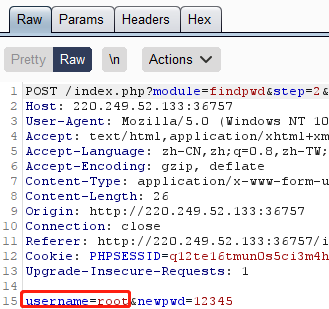  
把红框内，由自己的账户，改为 admin 账户，会修改成功：  
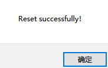  
那么我们用 admin 账户和新密码登录，发现在 manage 页面还会检查 ip，基于先验知识，猜测这个 ip 是 127.0.0.1，成功：  
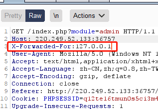  
但是，进入页面以后，没有任何可以操作的地方：  
  
那只能查看源码了：  
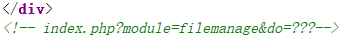  
果然有提示，那么我们用这两个 GET 参数试一试，发现并不行：  
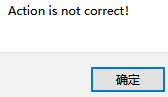  
这个提示似乎是说，我们的 do 参数是不对的，也的确，怎么可能是三个问号。联系 module 参数中的 filemanage，是一个文件管理，因此推测不是文件上传（upload）就是文件下载（download），这两种都存在漏洞。先尝试上传，因为，这种漏洞在 ctf 中见的更多：  
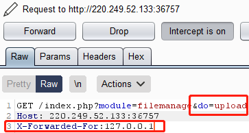  
结果出现了一个上传页面，果然是文件上传漏洞：  
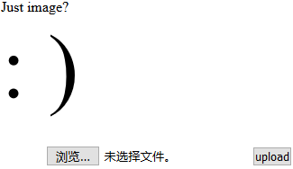  
根据 Just image 的提示，认为后缀名须是 .jpg 或者 .png 这种类型，然后编辑一段 php 代码：  
```php
//这里用的一句话木马，后面看了其他wp发现，好像随便整个php代码就行
<?php @eval($_POST['cmd']);?>
```
并把后缀名改为 .jpg：  
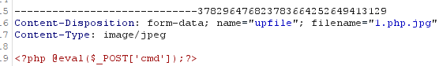  
结果不行，他识别出这是 php 文件了：  
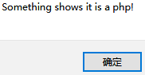  
应该是后缀名出现了 php？那我们尝试一下用 php5 绕过：  
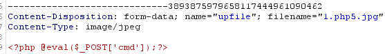  
结果还是不行  
  
有点迷惑，这还咋改啊？去看了看 wp，发现要改代码……  
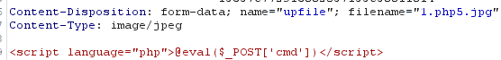  
芜湖，刺激，还是不行，不过这次终于没有检测出是 php 了：  
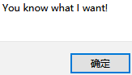  
他这个意思难道是本地检测 php？我们在 bp 里改一下文件名试试：  
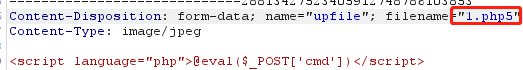  
并直接给出了 flag：  
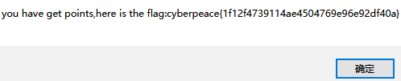  
