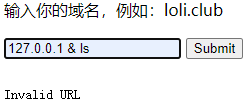

# cat
## 题目描述
抓住那只猫
## 思路
点开题目链接，是一个带有域名输入框的网站：  
  
随便输点东西进去，发现是 GET 请求：  
  
然后测试下服务器本机：  
  
出现了 ping 命令。思路去到了命令拼接注入，结果不成功：  
  
在 url 中尝试输入宽字节，会出现一段 html 代码：  
  
将代码保存到本地 html 文件，然后访问，发现：  
  
然后僵住了，后面看了大佬的 wp，才做出来。大佬的 wp 说，这是 django 的报错页面，并猜测这是将输入的参数传到了后端的 django 服务中进行解析，而 django 设置了编码为 gbk 导致错误编码了宽字符（超过了 ascii 码范围）。然后，要做 fuzz 测试，这我是真没想到，暂时也不怎么会……看 wp 说，是没有过滤 @ 符号。接着，原题目是有提示的：  
  
意思是可以用 @ 可以读取文件内容。结合 django 的报错得知了项目的绝对路径为 /opt/api。django 项目下一般有个 settings.py 文件是设置网站数据库路径（django 默认使用的的是 sqlites 数据库），如果使用的是其它数据库的话 settings.py 则设置用户名和密码。除此外 settings.py 还会对项目整体的设置进行定义。因此，读取 settings.py 文件，这里需要注意 django 项目生成时 settings.py 会存放在以项目目录下再以项目名称命名的文件夹下面。（其实本题中，settings.py 不是特别重要，因为之前的 html 页面中，已经有 settings 的信息了。）  
  
又是一段 html 代码，同上，继续打开网页：  
  
在 Settings 中，发现了一些信息，那么试着访问以下这个数据库：  
  
还是一段 html 代码，继续同上操作，在查看 html 页面时，发现了盲点：  
  
