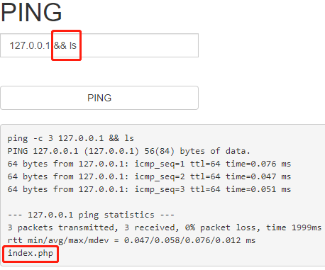
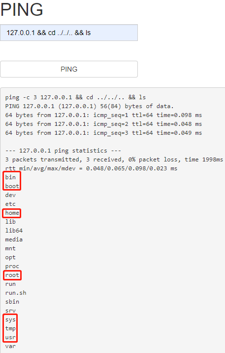
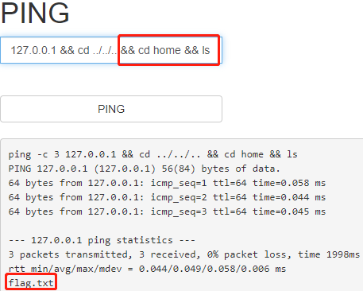
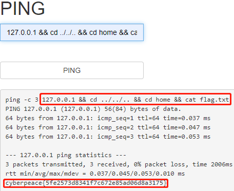

# command_execution
## 题目描述
小宁写了个ping功能,但没有写waf,X老师告诉她这是非常危险的，你知道为什么吗。  

http://220.249.52.133:45317  
点开链接，直接就是 ping ：  
  

先随便 ping 一个网址试试，就 ping 这个题目链接好了：  
  

可以，原来直接把命令拼接上了，看看能不能注入，在输入框键入指令：  
  

哇，太舒服了，顺着目录找一找，看看能不能找到有用的信息：  
  

这已经是根目录了，再加 /.. 没啥用了，然后，可能有用的目录就是红框框里的那么几个，每个目录访问一遍，最后发现，home 目录里有一个 flag.txt：  
  

那行了，直接用 cat 命令访问一下这个文件应该就可以了：  
  

得到 flag。  

## 相关知识
1. 在网络中 ping 是一个十分强大的 TCP/IP 工具。它的作用主要为：
（1）用来检测网络的连通情况和分析网络速度；
（2）根据域名得到服务器 IP；
（3）根据 ping 返回的 TTL 值来判断对方所使用的操作系统及数据包经过路由器数量。
我们通常会用它来直接ping IP地址，来测试网络的连通情况。
2. 除此之外还有一些其他的功能：
ping-t 的使用：
不间断地 ping 指定计算机，直到管理员中断。
这说明电脑连接路由器是通的，网络效果好。下面按住键盘的 Ctrl+c 终止它继续 ping 下去，就会停止了，会总结出运行的数据包有多少，通断的有多少了。
3. ping-a 的使用 
Ping-a 解析计算机名与 NetBios 名。就是可以通过 ping 它的 IP 地址，可以解析出主机名。 
4. ping-n 的使用
在默认情况下，一般都只发送4个数据包，通过这个命令可以自己定义发送的个数，对衡量网络速度都很有帮助，比如我想测试发送10个数据包的返回的平均时间为多少，最快时间为多少，最慢时间为多少就可以通过以下获知：
从以上可以知道在给 47.93.187.142 发送10个数据包的过程当中，返回了10个，没有丢失，这10个数据包当中返回速度最快为32ms，最慢为55ms，平均速度为37ms。说明我的网络良好。
如果对于一些不好的网络，比如监控系统中非常卡顿，这样测试，返回的结果可能会显示出丢失一部分，如果丢失的额比较多的话，那么就说明网络不好，可以很直观地判断出网络情况。
5. ping-I size的使用
ping-l size：发送size指定大小的到目标主机的数据包。 在默认的情况下 Windows 的 ping 发送的数据包大小为 32 byte，最大能发送 65500 byte。当一次发送的数据包大于或等于 65500 byte 时，将可能导致接收方计算机宕机。所以微软限制了这一数值；这个参数配合其它参数以后危害非常强大，比如攻击者可以结合 -t 参数实施 DOS 攻击。（所以它具有危险性，不要轻易向别人计算机使用）。
比如，ping -l 65500 -t 211.84.7.46 会连续对 IP 地址执行 ping 命令，直到被用户以 Ctrl+C 中断
如果你只有一台计算机也许没有什么效果，但如果有很多计算机那么就可以使对方完全瘫痪，网络严重堵塞，由此可见威力非同小可。
