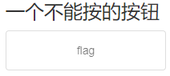
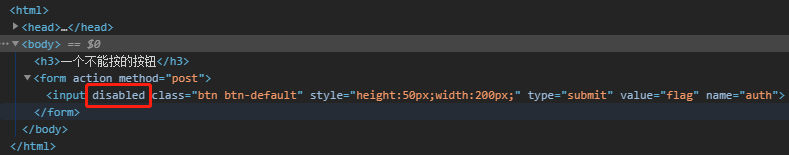
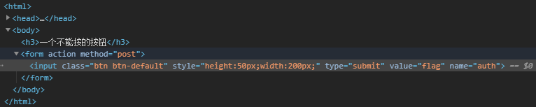
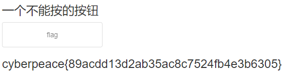

# cookie

## 题目描述：X老师今天上课讲了前端知识，然后给了大家一个不能按的按钮，小宁惊奇地发现这个按钮按不下去，到底怎么才能按下去呢？

### 思路
http://220.249.52.133:59378  
进入题目链接：

按钮无法点击，直接打开 F12，去看 Element 的代码：  

大概率是这个 disabled 搞的鬼，右键选择 Edit as HTML，尝试把 disabled 的值设为 false，没啥效果。  
那就直接删掉这个 disabled 吧：  

发现按钮可以点击了，点击按钮获得 flag：  

## 相关知识：
一般网页中的按钮无法点击，都是按钮元素中的 disabled 的值搞的鬼，有些网页可以将值设置为 false 来使得按钮可以点击，本题则需要删除这个变量。
