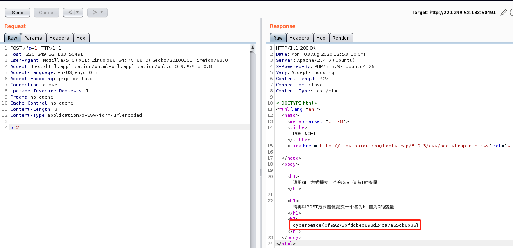

# get_post

## 题目描述
X老师告诉小宁同学HTTP通常使用两种请求方法，你知道是哪两种吗？

## 思路
http://220.249.52.133:50491/  
进入链接，显示：请用GET方式提交一个名为a，值为1的变量  
不错，直接在 url 里面加参数就行了：  
http://220.249.52.133:50491/?a=1  
  

好嘛，这下得用工具了，上 burp。在 repeater 中进行以下设置：  
``` html
POST /?a=1 HTTP/1.1  // 注意头部由 GET 变为 POST 了
Host: 220.249.52.133:50491
User-Agent: Mozilla/5.0 (X11; Linux x86_64; rv:68.0) Gecko/20100101 Firefox/68.0
Accept: text/html,application/xhtml+xml,application/xml;q=0.9,*/*;q=0.8
Accept-Language: en-US,en;q=0.5
Accept-Encoding: gzip, deflate
Connection: close
Upgrade-Insecure-Requests: 1
Pragma:no-cache   // GET 转 POST 时需要加
Cache-Control:no-cache   // GET 转 POST 时需要加
Content-Length: 3
Content-Type:application/x-www-form-urlencoded   // GET 转 POST 时需要加，必加

b=2  // POST 的参数
```
即可得到答案：  
  

## 补充知识：
使用 burp 时，需要首先浏览器中设置代理，这样 burp 才能拿到数据。  
如果初始网站是 GET 类型提交参数，若要想改为 POST 提交参数，则至少需要更改三处。  
第一处是 header 的方法，把 GET 改为 POST；第二处是，添加 Content-Type 参数，参数值为 application/x-www-form-urlencoded ；第三处为 POST 的变量，如题中的 b=2。  

**娘希匹！有了 Hackbar 还用什么 burp ！**
