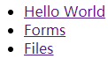
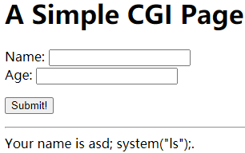
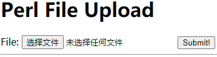
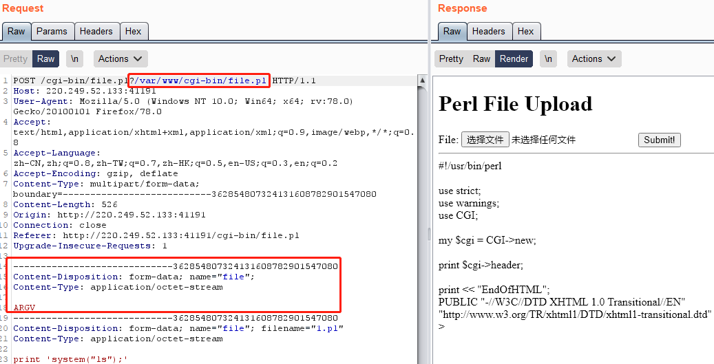
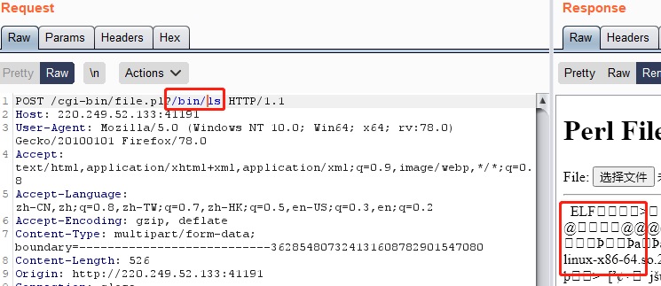
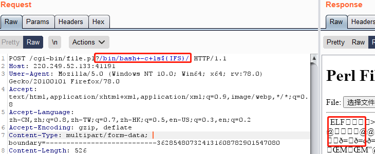
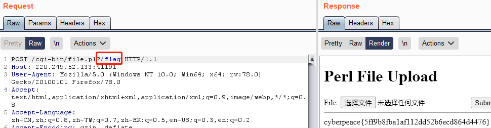

# i-got-id-200
## 题目描述
嗯。。我刚建好了一个网站
## 思路
http://220.249.52.133:41191  
点开题目链接：  
  
依次打开，Hello World 有提示，这个网页是 perl 写的；Forms 网页如下：  
  
用 sqlmap 尝试了一下，没法注入，继续看下一个：  
  
有可能存在文件上传漏洞，然而，并不会 perl。去看了 wp。大佬猜测的代码如下：
```perl
use strict;
use warnings; 
use CGI;
my $cgi= CGI->new; 
if ( $cgi->upload( 'file' ) ) { 
    my $file= $cgi->param( 'file' ); 
    while ( <$file> ) { 
        print "$_"; 
    }
} 
```
***
那么，这里就存在一个可以利用的地方，param() 函数会返回一个列表的文件但是只有第一个文件会被放入到下面的 file 变量中。而对于下面的读文件逻辑来说，如果我们传入一个 ARGV 的文件，那么 Perl 会将传入的参数作为文件名读出来。这样，我们的利用方法就出现了：在正常的上传文件前面加上一个文件上传项 ARGV，然后在 URL 中传入文件路径参数，这样就可以读取任意文件了。
***
我们上传一个文件，并用 bp 拦截，然后添加一段，上传 ARGV 文件的代码，并用 file.pl 做检测，由于多数网站的目录都是在 /var/www/ 下，因此，也做这种猜测：  
  
成功回显代码，然后再试图寻找 flag：  
  
回显一堆乱码，看了大佬的 wp，好像要用 /bin/bash -c ls${IFS}/ ，我的用 %20 替换空格没反应，所以用的 +：  
  
还是一堆乱码……改了显示编码也不行，不知道咋回事，直接去访问了 flag：  
  

## 补充知识
* Linux中，/bin/bash 是 bash 解释器，这句话当作文件名时，首先会去寻找 /bin/bash 并且输出，那就是执行了解释器的功能。  
* bash -c 的语法是，后面跟的第一个参数会当作命令来被 bash 解析，第二，第三个参数被认为是 bash 的参数，而不是第一个参数（命令）的参数。  
