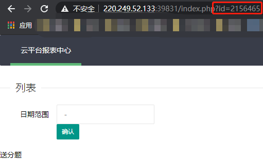
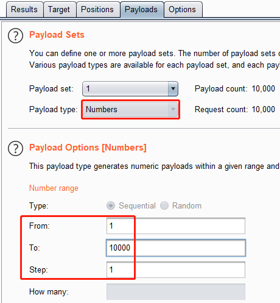
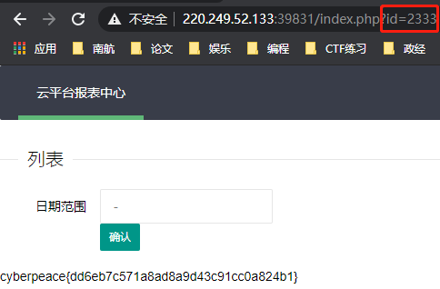

# ics-06
## 题目描述
云平台报表中心收集了设备管理基础服务的数据，但是数据被删除了，只有一处留下了入侵者的痕迹。
## 思路
http://220.249.52.133:39831  
点开题目链接，是一个十分华丽的页面：  
  
看了看源码，没啥提示。把所有“按钮”都点一遍，发现只有“报表中心”能点进去，这应该就是题目描述里的“入侵者的痕迹”了。  
http://220.249.52.133:39831/index.php?id=1  
  
嗯，送分题，我谢谢你。查看源码，依旧没啥有用的信息，由此，把注意力放在了 url 中的 id 身上。尝试了一些可能的操作，包括 sql 万能注入啥的，没什么卵用，全都跳回 id=1 的页面，network 中也没有有用的信息。寻思着试试改改 id 的数值吧，这下发现了希望，虽然不管 id 设置什么数值，都在同一个页面，但是，每个页面的 url 是不一样的：  
  
那就试试爆破吧。还是老操作，设置浏览器代理，用 burp 拦截，然后把拦截的请求包发往 intruder，这下 intruder 自动把 id 辨识成为了要爆破的地方，GET /index.php?id=$1$。太好了，直接去设置一下 payloads 即可：  
  
跑（start attack）就完了，只不过那数字是 id=2333，又是从 1 开始爆破的，等的时间有点久，等的我有点绝望了都，但是终归是爆破出了 flag：  
  
其实，这种题，可以在爆破的同时，试几个比较特殊的数字，比如 666、999、2333 等。毕竟，burp 的爆破速度不算快。
