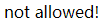
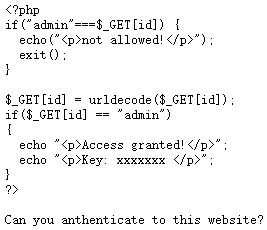
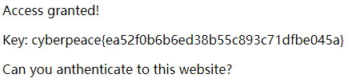

# php2
## 题目描述
暂无
## 思路
http://220.249.52.133:51102  
点开题目链接：  
  
既然是和登录有关，肯定与 id 有关系，试一下：  
http://220.249.52.133:51102/?id=admin  
  
没什么有用的东西。也查看了网页源码及 F12 中的请求包和回应包，没什么有价值的东西。从网上找了个提示，发现会存在一个后缀为 phps 的文件。  
***
phps 文件就是 php 的源代码文件，通常用于提供给用户（访问者）查看 php 代码，因为用户无法直接通过 Web 浏览器看到 php 文件的内容，所以需要用 phps 文件代替。其实，只要不用 php 等已经在服务器中注册过的MIME类型为文件即可，但为了国际通用，所以才用了phps文件类型。  
它的MIME类型为：text/html, application/x-httpd-php-source, application/x-httpd-php3-source。  
***
那就去访问一下这个 phps 文件咯：  
http://220.249.52.133:51102/index.phps  
  
审计一下代码，首先进行强类型比较，比较成功则输出 not allowed，否则进行 url 解码，再进行弱类型比较，比较成功即可输出 Key。因此，利用二次注入的知识构造 url：  
http://220.249.52.133:51102/?id=%2561dmin  
  
得到了 flag。  
