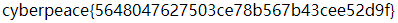

# Robots

## 题目描述
X老师上课讲了Robots协议，小宁同学却上课打了瞌睡，赶紧来教教小宁Robots协议是什么吧。

## 思路
http://220.249.52.133:40943  
点开题目链接，发现是空的。看看源码有什么小彩蛋，显示 “flag is not here”。  

好吧，按题目描述的思路来。去查了一下 Robots 协议。先去访问网站根目录下的 robots.txt 文件，看看有什么有用的信息。  
http://220.249.52.133:40943/robots.txt  
进入上述链接，发现有用的东西，如图所示：  
  

flag 大概率在这个 php 文件中了，访问一下这个文件：  
http://220.249.52.133:40943/f1ag_1s_h3re.php  
轻松得到 flag：  
  

## 相关知识：  
### robots协议  
robots协议也叫robots.txt（统一小写）是一种存放于网站根目录下的 ASCII 编码的文本文件，它通常告诉网络搜索引擎的漫游器（又称网络蜘蛛），此网站中的哪些内容是不应被搜索引擎的漫游器获取的，哪些是可以被漫游器获取的。  
因为一些系统中的URL是大小写敏感的，所以 robots.txt 的文件名应统一为小写。robots.txt 应放置于网站的根目录下。  
如果想单独定义搜索引擎的漫游器访问子目录时的行为，那么可以将自定的设置合并到根目录下的 robots.txt，或者使用robots元数据（Metadata，又称元数据）。  
robots 协议并不是一个规范，而只是约定俗成的，所以并不能保证网站的隐私。  
robots.txt 文件是一个文本文件，使用任何一个常见的文本编辑器，比如 Windows 系统自带的 Notepad，就可以创建和编辑它。robots.txt 是一个协议，而不是一个命令。  
**robots.txt 是搜索引擎中访问网站的时候要查看的第一个文件。**  
robots.txt 文件告诉蜘蛛程序在服务器上什么文件是可以被查看的。  
