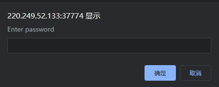
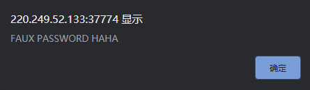
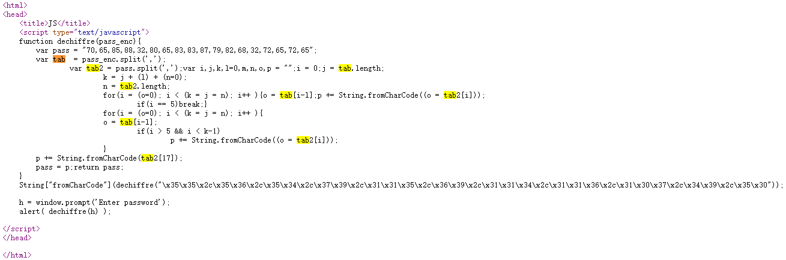
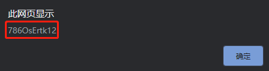

# simple_js
## 题目描述
小宁发现了一个网页，但却一直输不对密码。(Flag格式为 Cyberpeace{xxxxxxxxx} )  
## 思路
http://220.249.52.133:37774  
进入题目链接，发现让输密码：  
  

随便输几个试试，发现不论输入什么，都是出来这个东西：  
  

直接看网页源码好了：  
  

写的真乱啊，整理一下代码，去除一些无用变量，以及合并循环后：  
```html
<html>
<head>
    <title>JS</title>
    <script type="text/javascript">
    function dechiffre(){
        var pass = "70,65,85,88,32,80,65,83,83,87,79,82,68,32,72,65,72,65";
        var tab2 = pass.split(',');
        var i;
        p="";
       for(i = 0; i < tab2.length; i++ ){
           p += String.fromCharCode((o = tab2[i]));
       }
       return p;
    }
    String["fromCharCode"](dechiffre("\x35\x35\x2c\x35\x36\x2c\x35\x34\x2c\x37\x39\x2c\x31\x31\x35\x2c\x36\x39\x2c\x31\x31\x34\x2c\x31\x31\x36\x2c\x31\x30\x37\x2c\x34\x39\x2c\x35\x30"));
    alert( dechiffre() );

</script>
</head>

</html>
```

本题只是前端的东西在搞，根本没有访问后端数据库，因此，我们直接尝试把 \x35 那一串编码放入代码的 pass 参数中：  
```html
<html>
<head>
    <title>JS</title>
    <script type="text/javascript">
    function dechiffre(){
        var pass = "\x35\x35\x2c\x35\x36\x2c\x35\x34\x2c\x37\x39\x2c\x31\x31\x35\x2c\x36\x39\x2c\x31\x31\x34\x2c\x31\x31\x36\x2c\x31\x30\x37\x2c\x34\x39\x2c\x35\x30";
        var tab2 = pass.split(',');
        var i;
        p="";
       for(i = 0; i < tab2.length; i++ ){
           p += String.fromCharCode((o = tab2[i]));
       }
       return p;
    }
    alert(dechiffre());

</script>
</head>

</html>
```

将上述代码保存为 HTML 文件，再用浏览器打开，得到 flag：  
  
