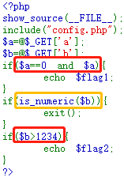
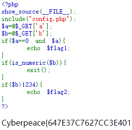
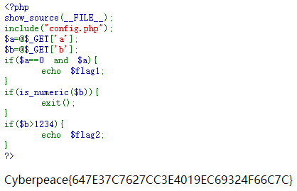

# simple_php
## 题目描述
小宁听说php是最好的语言,于是她简单学习之后写了几行php代码。

## 思路
点开题目链接 http://220.249.52.133:30599/  
  

给了一段 php 的代码，分析一波代码，可以发现，需要满足红色框的判断条件，且不能满足黄色框的判断条件才能获得全部 flag。  
第一个红色框需要用字符串绕过：http://220.249.52.133:30599/?a=a  
  

得到一部分 flag ……  
继续去搞黄色框和第二个红色框，发现，黄色框需要绕过，尝试在 b=1235 后面加 %20 ：  
http://220.249.52.133:30599/?a=0%20&&%20b=1235%20  
  

成功获得 flag。  

## 相关知识
1. 类型比较：  
松散比较：==。只比较值，不比较类型。因此题目中的 $a==0 可以用字符来绕过。  
严格比较：===。既比较值也要比较类型。  
2. is_numeric() 函数：  
该函数用于判断变量是否为数字或数字字符串，不仅可以检查十进制，也可以检查十六进制。  
is_numeric() 函数对于空字符 %00，无论是 %00 放在前后都可以判断为非数值，而%20空格字符只能放在数值后。查看函数发现该函数对于第一个空格字符会跳过空格字符判断，接着后面的判断！后经尝试，在数值后加字符也可以绕过。
