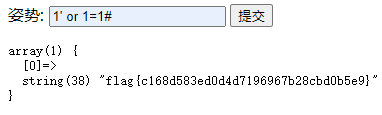

# supersqli
## 题目描述
随便注
## 思路
http://220.249.52.133:53208  
点开题目链接，有文本框，那就先随便试试，点个提交：  
  
用万能语句注入试试：  
  
成功了，且注释 # 没被过滤。  
再试试 union select 呢：  
  
显示 select 等关键词被 preg_match 的方法过滤了，且 /i 表示忽略大小写。测试了下 /**/、--+ 等注释方式，发现除了 # 都被过滤了，那也就无法用注释符绕过 preg_match 了。尝试一下堆叠注入，看看能不能爆出数据库：  
  
成功了，再查一下所有的表：  
  
再分别查一下这两个表（"1919810931114514"，"words"）各有哪些列：  
  
这里需要注意的是，查看表中的列需要用以下命令：
```  
1' ; show columns from `1919810931114514`;
```
一直无法访问"1919810931114514"表，去查了一下，有可能需要加 ` 符号，尝试一下就成功了。该符号不是单引号，而是反撇号，即 tab 上边那个键。原因没查到，但是如果表名是关键词的话，如 order ，需要加反撇号，用以区分关键词和表名。猜测纯数字的表名可能与这个类似。  
  
猜测默认的查询表格应该是 words，因为只有 words 表格里才有一个 id 对应一个 data 的操作，即一个数字对应一个字符串。  
因此，更改一下表格的名字，让默认查询的表格在潜移默化中变为带有 flag 的数字表格：  
```
1';rename tables `words` to `wor，ds1`;rename tables `1919810931114514` to `words`; alter table `words` change `flag` `id` varchar(100);
```
这是把原来的 words 表重命名为 words1 表，然后把数字表更名为 words 表，再用 flag 列名去替换 id。  
再用万能注入，把数字表格的列都爆出来即可得到 flag：  
  
