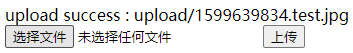
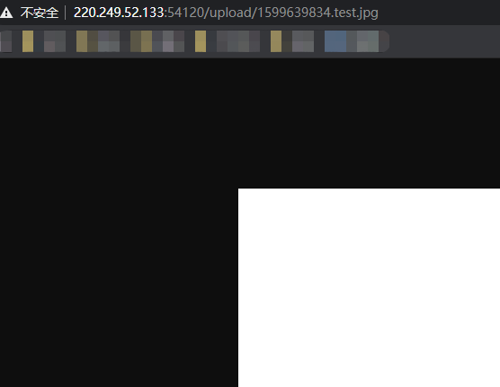
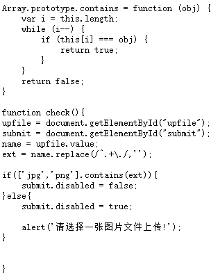
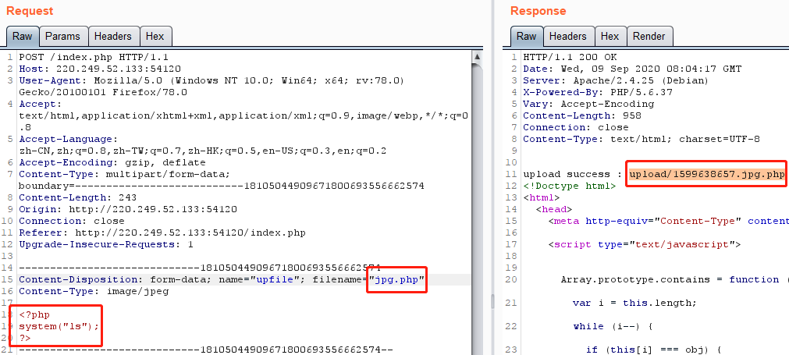
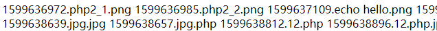
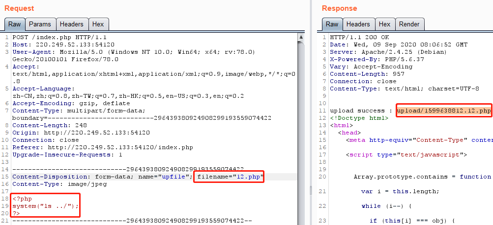
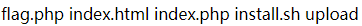
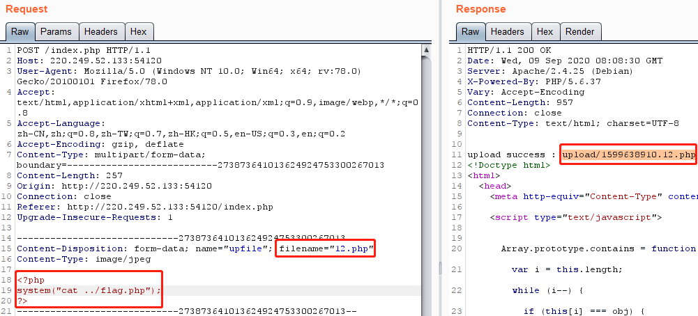
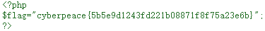

# upload1
## 题目描述
暂无
## 思路
http://220.249.52.133:54120  
点开题目链接，是一个文件上传的界面，且根据题目名，应该是要考察文件上传漏洞：  
  
先随便上传几个文件，发现有检测，只能上传图片：  
  
上传一张图片，看看啥效果：  
  
是一个类似于 url 后缀的地址，看看能不能访问：  
http://220.249.52.133:54120/upload/1599639834.test.jpg  
  
但是访问 upload 这个文件夹却被拒绝了：  
  
查看一下之前的网页源码，发现了过滤源码，是前端来检查后缀名是否是 jpg 或者 png：  
  
既然如此，我们先写一段 php 代码：  
```php
<?php
system("ls");
?>
```
然后把文件名改为 xxx.jpg 的格式，上传，并用 burp 拦截数据包，给后缀改为正常后缀：  
  
接着访问这个 php 文件：  
http://220.249.52.133:54120/upload/1599638657.jpg.php  
  
全都是些之前上传的文件，且没有文件夹，那么我们看看父目录：  
```php
<?php
system("ls ../");
?>
```
同样需要绕过前端检查：  
  
http://220.249.52.133:54120/upload/1599638812.12.php  
  
芜湖，有 flag.php，那么我们再整一个访问该文件的 php：  
```php
<?php
system("ls ../");
?>
```
绕过前端检查：  
  
http://220.249.52.133:54120/upload/1599638910.12.php  
打开网页发现是空的，我还以为命令输错了……确认过后，应该是没错，然后查看网页源码，发现了 flag：  
view-source:http://220.249.52.133:54120/upload/1599638910.12.php  
  
