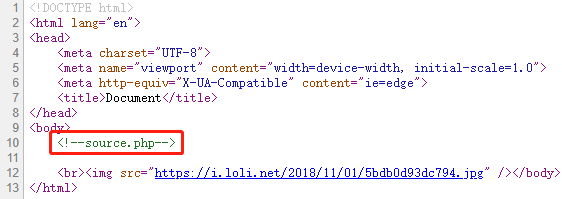
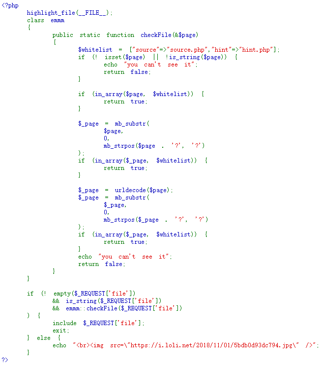
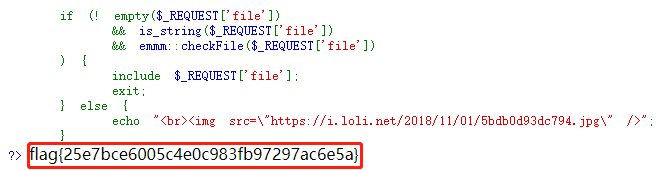

# warmup
## 题目描述
暂无
## 思路
http://220.249.52.133:59657  
点开题目链接，一个大大的滑稽，查看源码，有个注释提示了 source.php 文件：  
  
查看一下该文件，发现了 php 源码：  
http://220.249.52.133:59657/source.php  
  
又发现了 hint.php 文件，再去访问一下，看看有什么提示：  
http://220.249.52.133:59657/hint.php  

说是 flag 在 ffffllllaaaagggg 这个文件中，再去回头审计一下 source.php 的源码：  
```php
<?php
    highlight_file(__FILE__);
    ......
    if (! empty($_REQUEST['file'])
        && is_string($_REQUEST['file'])
        && emmm::checkFile($_REQUEST['file'])
    ) {
        include $_REQUEST['file'];
        exit;
    } else {
        echo "<br>";
    }  
?>
```
要想 include 想查看的文件，需要经过三个判断条件：  
  1. 值非空  
  2. 值为字符串类型  
  3. 满足 emmm::checkFile 的检查  
否则，输出滑稽表情。前两个好说，重点在 emmm::checkFile 的检查。因此，需要审计一下这段代码：  
```php
<?php
    highlight_file(__FILE__);
    class emmm {
        public static function checkFile(&$page){
            //白名单
            $whitelist = ["source"=>"source.php","hint"=>"hint.php"];
            //必须设置值且值为字符串类型
            if (! isset($page) || !is_string($page)) {
                echo "you can't see it";
                return false;
            }
            //值需要是白名单里的值
            if (in_array($page, $whitelist)) {
                return true;
            }
            //取拼接后的字符串中，第一个?之前的值
            $_page = mb_substr(
                $page,
                0,
                mb_strpos($page . '?', '?')//获得拼接后的字符串中，第一个?出现的位置
            );
            //更新后的值依然需要在白名单中
            if (in_array($_page, $whitelist)) {
                return true;
            }
            //url解码
            $_page = urldecode($page);
            //继续取拼接后的字符串中，第一个?之前的值
            $_page = mb_substr(
                $_page,
                0,
                mb_strpos($_page . '?', '?')
            );
            //更新后的值依然需要在白名单中
            if (in_array($_page, $whitelist)) {
                return true;
            }
            
            //若以上带有 return true 的判断均未奏效，则返回 false
            echo "you can't see it";
            return false;
        }
    }
    ......
?>
```
经过分析发现，前三个带有 return true 的判断均难以利用，只有第四个，在 url 解码后进行判断的 return true 可以尝试利用，因此，把目光集中在这。这时会考虑二次注入，因为在服务器端提取参数时会解码一次，源码中又用 urldecode() 函数解码了一次。查询 url 编码可知 %253f 在二次解码后仍为 ?，因此，构造 url：  
http://220.249.52.133:59657/source.php?file=source.php%253f/ffffllllaaaagggg  
解释一下为什么构造 ?file=source.php 这一部分，因为如果直接使用 /source.php%253f/ffffllllaaaagggg 服务器无法辨识，此时尚未进入 php 源码的执行，因此，只能执行一次 url 解码。因此，需要让其进入代码再去执行。第一个 source.php 相当于进入 php 源码，?file=source.php%253f/ffffllllaaaagggg 部分，才是真正在 php 源码中执行的命令，即为 file 变量赋值source.php%253f/ffffllllaaaagggg。  
结果发现没啥用……判断有可能是在父目录中，因此用 ../ 去寻找 ffffllllaaaagggg 文件，耐心去找……终于在第五个 ../ 下，找到了对应文件：  
http://220.249.52.133:59657/source.php?file=source.php%253f../../../../../ffffllllaaaagggg  
  
