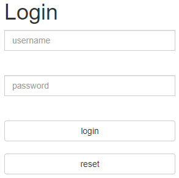
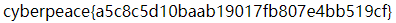
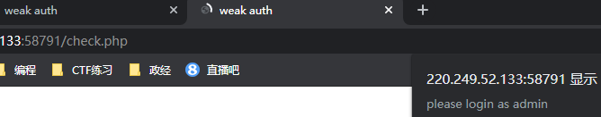
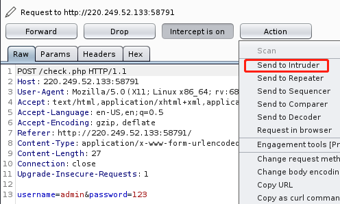
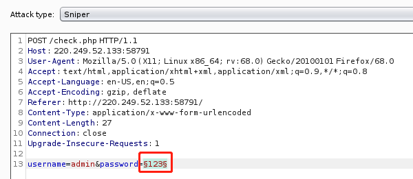
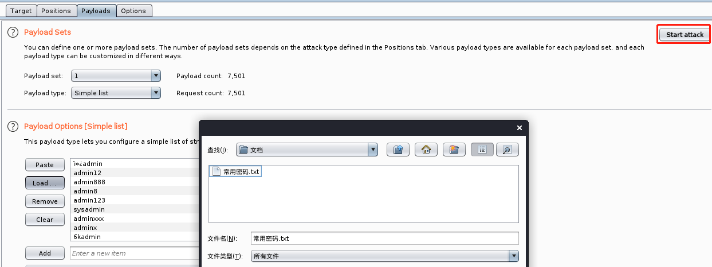
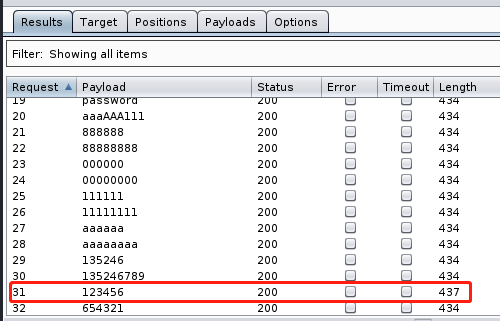
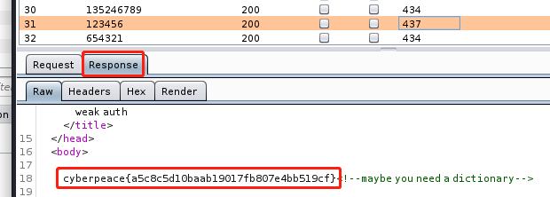

# weak_auth
## 题目描述
小宁写了一个登陆验证页面，随手就设了一个密码。

## 思路
http://220.249.52.133:58791  
进入链接，发现一个登陆界面：  
  
***
那既然是随便设了一个密码，那就试一试默认的管理员账户名密码呗，admin & 123456。  
刺激：  
  
***
好了，说正常人思路。  
这种题，一般是先随便输用户名密码，然后看提示，让用 admin 登录，并且跳转到了 check.php ：  
  

查看一下 http://220.249.52.133:58791/check.php 的源码，发现需要字典：  
  

那么，我们用 burpsuite 截下登录的数据包，然后把数据包发送到 intruder 爆破：  
  

设置爆破点为 password （加 $ $ 的是即将爆破的地方）：  
  

加载字典：  
  

开始攻击，并查看响应包列表，发现密码为 123456 时，响应包的长度和别的不一样：  
  

点进去，查看响应包，获得 flag：  
  
