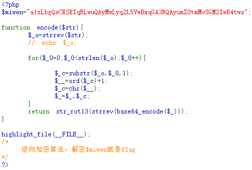
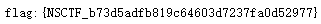

# web2
## 题目描述
解密
## 思路
http://220.249.52.133:37573  
点开题目链接，是一段代码：  
  
进行代码审计，根据题目描述以及注释可知，$miwen 是一个被加密了的字符串，encode 函数是一个加密函数，我们要做的就是，写一个解密算法，把 $miwen 变量对应的明文解密出来。  
首先分析一下 encode 函数的主干：  
```php
$_o=strrev($str); //反转字符串

for($_0=0;$_0<strlen($_o);$_0++){
    $_c=substr($_o,$_0,1); //每次从字符串中选择一个字符
    $__=ord($_c)+1; //asc码+1
    $_c=chr($__); //返回新asc码对应的字符
    $_=$_.$_c;   //拼接得到新的字符串
} 

//返回值为：对经拼接得到的新字符串，先进行 base64 编码
//然后反转字符串，最后进行 rot13 编码
return str_rot13(strrev(base64_encode($_)));
```
既然我们知道了加密过程，那么我们很容易写一个解密算法出来，用以恢复密文：  
```
<?php
$str="a1zLbgQsCESEIqRLwuQAyMwLyq2L5VwBxqGA3RQAyumZ0tmMvSGM2ZwB4tws";

//对加密函数中的返回值进行逆处理
//先用 rot13 解码，再反转字符串，最后 base64 解码
$_o=base64_decode(strrev(str_rot13($str)));

for($_0=0;$_0<strlen($_o);$_0++){
	$_c=substr($_o,$_0,1);
	$__=ord($_c)-1;//对asc码-1处理
	$_c=chr($__);
	$_=$_.$_c;   
} 
echo strrev($_); // 反转新的字符串并输出，得到flag
?>
```
运行一下，轻易得到 flag：  
  
