# webshell
## 题目描述
小宁百度了php一句话,觉着很有意思,并且把它放在index.php里。  
## 思路
http://220.249.52.133:45041  
打开链接：  
  

根据题意，这是直接把这句话写到 index.php 里了，直接用菜刀利用漏洞：  
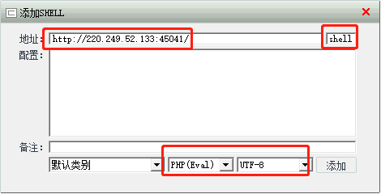 

然后进行文件管理，看看都有些什么东西：  
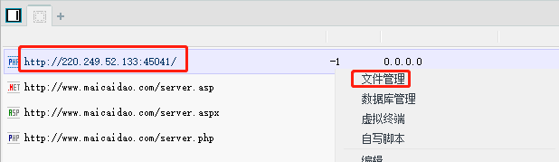  

直接看到了 flag.txt ：  
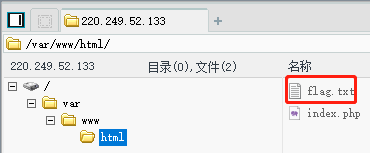  

获得 flag：  
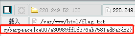  

---
本题还可以用 burpsuit 做。  
用 burp 拦截：  
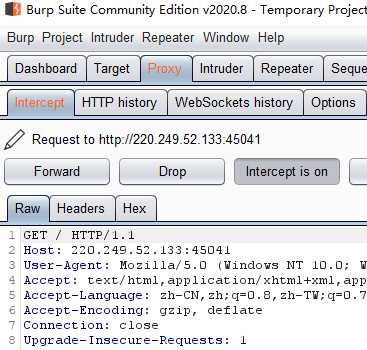  

然后传到 repeater，由于是 POST 漏洞，以及 shell 变量，因此需要修改，并添加 shell=system("find / -name 'flag.*'");  
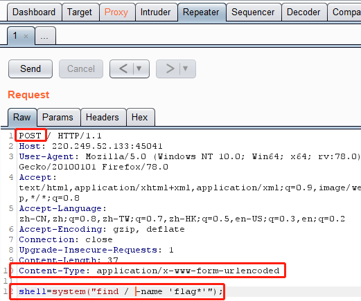  

send 后，查看响应包：  
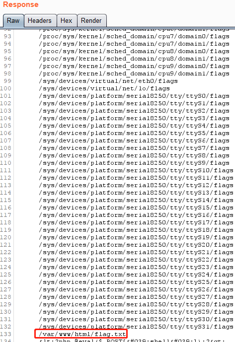  

发现了神奇的东西，再用 burp 的 repeater 更改一下参数：  
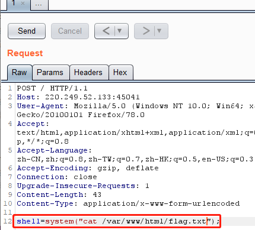  

得到 flag：  
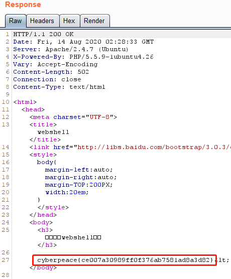  

---
第三种方法：使用 hackbar  
本方法需要开启 POST：  
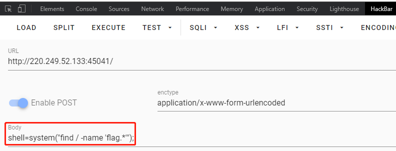  
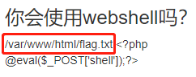  
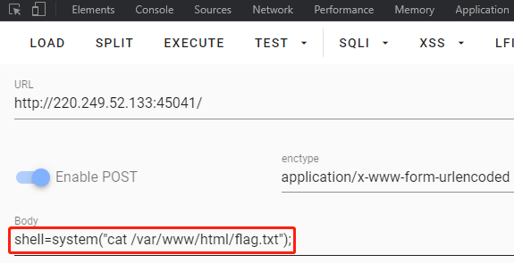  
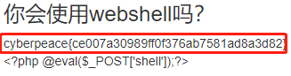  

