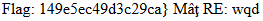

# wtf.sh-150
## 题目描述
暂无
## 思路
点开链接：  
  
离谱的画面，但是看到有注册和登录，猜想这一部分肯定是要用到的一个地方。注册 admin，说账户已存在，因此随便注册了一个。由于没什么头绪，因此查看了登录后的请求包，有一段 cookie：  
  
只要获得了 TOKEN，岂不就可以用 bp 伪造 admin 查看页面了？然而在此僵住了，不知道该怎么搞了。看了 wp，发现要进行路径穿越？？听都没听到过好嘛！不愧世界赛的题，打扰了。构造路径穿越的 payload：  
http://220.249.52.133:59435/post.wtf?post=../  
用 ctrl+f 找关键信息，没有 hint，但是找到了 flag 的相关内容：  
  
一看前后有 <html> 和 </html>，可知这是段 html 的代码，格式化一下：  
```html
<html> 
<head> 
    <link rel="stylesheet" type="text/css" href="/css/std.css" > 
</head> 
$ if contains 'user' ${!URL_PARAMS[@]} && file_exists "users/${URL_PARAMS['user']}" 
$ then 
    $ local username=$(head -n 1 users/${URL_PARAMS['user']}); 
    $ echo "<h3>${username}'s posts:</h3>"; 
    $ echo "<ol>";
    $ get_users_posts "${username}" | while read -r post; do 
        $ post_slug=$(awk -F/ '{print $2 "#" $3}' <<< "${post}"); 
        $ echo "<li><a href=\"/post.wtf?post=${post_slug}\">$(nth_line 2 "${post}" | htmlentities)</a></li>"; 
    $ done 
    $ echo "</ol>"; 
    <!--------------重要---------------->
    $ if is_logged_in && [[ "${COOKIES['USERNAME']}" = 'admin' ]] && [[ ${username} = 'admin' ]] 
    $ then 
        $ get_flag1 
    $ fi 
    <!--------------重要结束------------->
$ fi 
</html>
```
由那段重要的代码块可知，当 cookie 中的信息为 admin 的信息时，可以获得 flag1。因此，试图去找 admin 的相关信息：  
  
发现了 users 目录，因此去访问一下这个目录并直奔 admin 的信息：  
http://220.249.52.133:59435/post.wtf?post=../users  
  
然后，刷新主页，并用 burp 改信息，这里刷新主页的作用是为了获取后面查看 Profile 时，用到的 user 的值：  
  
可以看到，我们已经是 admin 了：  
  
查看 Profile，同样需要用 burp 改信息，GET 参数的 user 即是从主页过来时传递的：  
  
成功查看到 flag……的一半（RNM！）  
  
后面再次僵住，再次看大佬的 wp，发现直接看不懂了，后一半的 flag，是跟着大佬的 wp 一步一步复现出来的……因为 wtf 不是常规的网页文件，故寻找解析 wtf 文件的代码：  
  
格式化：  
```html
max_page_include_depth=64
page_include_depth=0
function include_page {
    # include_page pathname
    local pathname=$1
    local cmd=
    [[ ${pathname(-4)} = '.wtf' ]];
    local can_execute=$;
    page_include_depth=$(($page_include_depth+1))
    if [[ $page_include_depth -lt $max_page_include_depth ]]
    then
        local line;
        while read -r line; do
            # check if we're in a script line or not ($ at the beginning implies script line)
            # also, our extension needs to be .wtf
            [[ $ = ${line01} && ${can_execute} = 0 ]];
            is_script=$;
            # execute the line.
            if [[ $is_script = 0 ]]
            then
                cmd+=$'n'${line#$};
            else
                if [[ -n $cmd ]]
                then
                    eval $cmd  log Error during execution of ${cmd};
                    cmd=
                fi
                echo $line
            fi
        done  ${pathname}
    else
        echo pMax include depth exceeded!p
    fi
}
```
能够解析并执行 wtf 文件，如果还能够上传 wtf 文件并执行的话，就可以达到控制服务器的目的。于是继续审计代码，发现如下代码给了这个机会：  
```html
function reply {
    local post_id=$1;
    local username=$2;
    local text=$3;
    local hashed=$(hash_username "${username}");
    curr_id=$(
    for d in posts/${post_id}/*; 
    do basename $d; 
    done | sort -n | tail -n 1);
    next_reply_id=$(awk '{print $1+1}' <<< "${curr_id}");
    next_file=(posts/${post_id}/${next_reply_id});
    echo "${username}" > "${next_file}";
    echo "RE: $(nth_line 2 < "posts/${post_id}/1")" >> "${next_file}";
    echo "${text}" >> "${next_file}";
    # add post this is in reply to to posts cache
    echo "${post_id}/${next_reply_id}" >> "users_lookup/${hashed}/posts";
}
```
这是评论功能的后台代码，这部分也是存在路径穿越的。这行代码把用户名写在了评论文件的内容中：  
```html
echo "${username}" > "${next_file}";
```
如果用户名是一段可执行代码，而且写入的文件是 wtf 格式的，那么这个文件就能够执行我们想要的代码。先普通地评论一下，知晓评论发送的数据包的结构。在普通评论的基础上，进行路径穿越，上传后门sh.wtf，并发现可以执行。为了写入恶意代码，我们得让用户名里携带代码，故注册这样一个用户：  
  
写入后门，路径最后要加 %09，即水平制表符，否则服务器会将 sh.wtf 识别为一个目录：  
  
访问后门，执行代码，寻找get_flag2（因为之前获得 flag1 的时候是 get_flag1）：  
  
再注册一个访问 get_flag2 的用户：  
  
同样写入后门：  
  
访问后门，获得后半段 flag：  
  

## 考察知识点
1. wtf 文件特性  
2. 路径穿越  
3. html 代码审计
